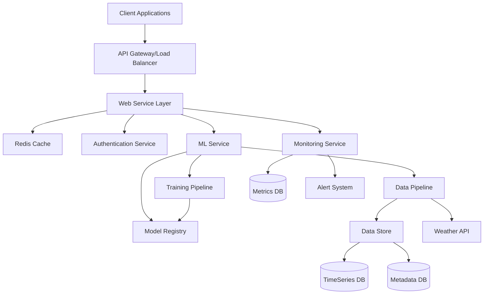
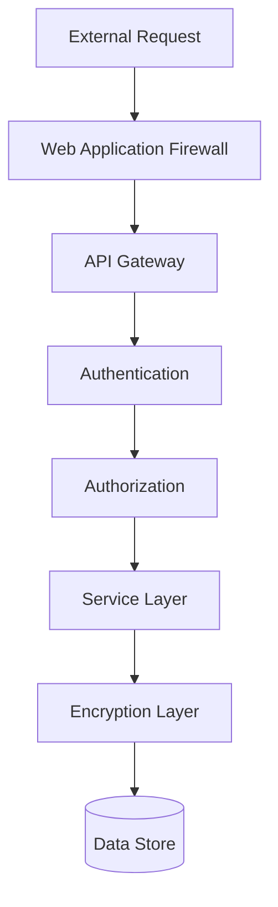
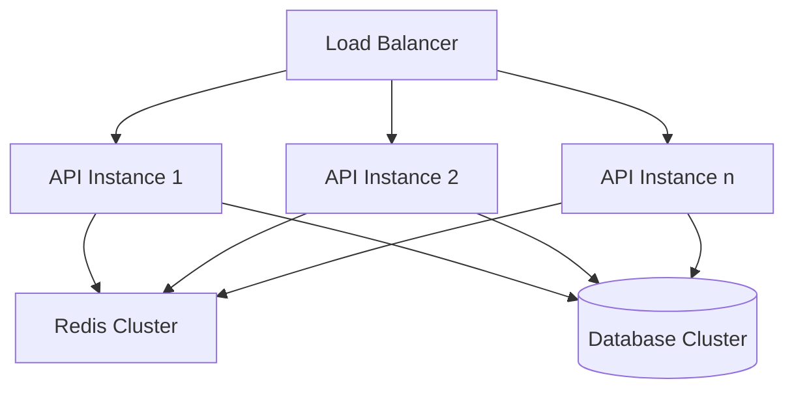
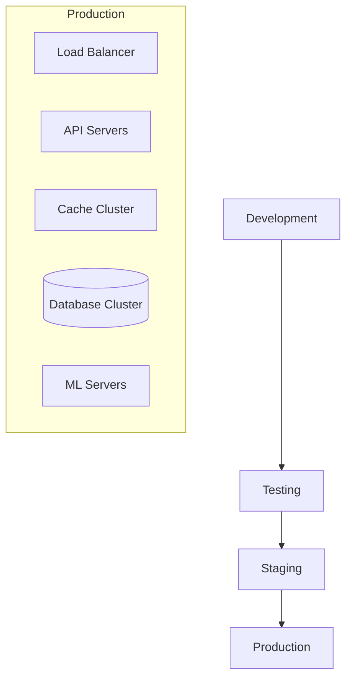
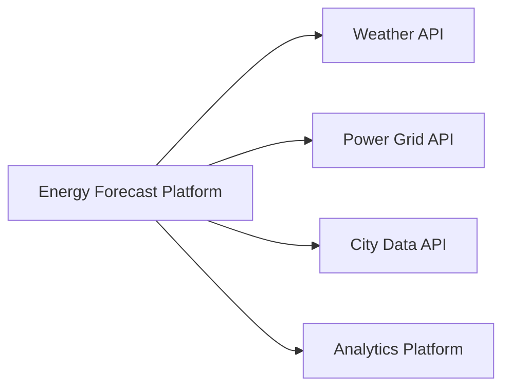
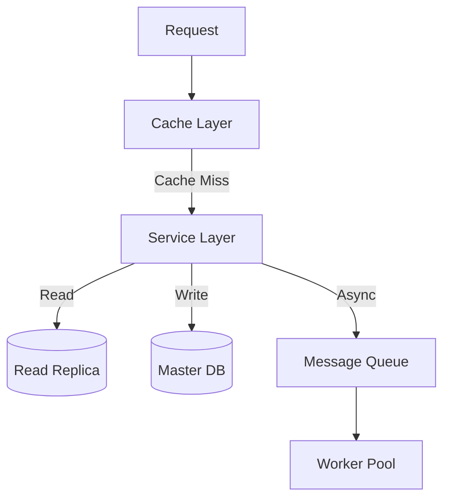

# Architecture Overview

## System Architecture

The Energy Forecast Platform is built on a modern, scalable, and resilient architecture designed to handle large-scale energy consumption predictions across Indian cities.



## Core Components

### 1. API Layer
- **API Gateway**
  - Rate limiting
  - Request validation
  - Load balancing
  - SSL termination
  - API versioning

- **Web Service**
  - FastAPI-based REST API
  - Async request handling
  - Input validation
  - Response caching
  - Error handling

### 2. Machine Learning Layer
- **Model Service**
  ```mermaid
  graph LR
      Input[Input Data] --> Preprocess[Preprocessor]
      Preprocess --> LSTM[LSTM Model]
      Preprocess --> XGB[XGBoost Model]
      Preprocess --> Trans[Transformer Model]
      LSTM --> Ensemble[Ensemble]
      XGB --> Ensemble
      Trans --> Ensemble
      Ensemble --> Output[Predictions]
  ```

- **Training Pipeline**
  ```mermaid
  graph TD
      Data[Raw Data] --> Clean[Data Cleaning]
      Clean --> Feature[Feature Engineering]
      Feature --> Split[Train/Test Split]
      Split --> Train[Model Training]
      Train --> Evaluate[Evaluation]
      Evaluate --> Register[Model Registry]
  ```

### 3. Data Layer
- **Data Pipeline**
  ```mermaid
  graph LR
      Sources[Data Sources] --> Collect[Data Collection]
      Collect --> Validate[Validation]
      Validate --> Transform[Transformation]
      Transform --> Load[Data Loading]
      Load --> Store[(Data Store)]
  ```

- **Storage Systems**
  - TimescaleDB for time-series data
  - PostgreSQL for metadata
  - Redis for caching
  - S3 for model artifacts

### 4. Monitoring Layer
- **Metrics Collection**
  - System metrics
  - Application metrics
  - Model performance metrics
  - Business metrics

- **Alerting System**
  - Performance alerts
  - Error alerts
  - Model drift alerts
  - Resource utilization alerts

## Security Architecture



### Security Components
1. **Authentication**
   - JWT-based authentication
   - Role-based access control
   - API key management
   - Session management

2. **Data Security**
   - Encryption at rest
   - Encryption in transit
   - Data masking
   - Access logging

## Scalability Architecture



### Scalability Components
1. **Horizontal Scaling**
   - Auto-scaling groups
   - Load balancing
   - Service discovery
   - Health checks

2. **Data Scaling**
   - Database sharding
   - Read replicas
   - Cache clustering
   - Data partitioning

## Deployment Architecture



### Deployment Components
1. **Infrastructure**
   - Kubernetes clusters
   - Container registry
   - Configuration management
   - Secret management

2. **CI/CD Pipeline**
   - Automated testing
   - Deployment automation
   - Rollback procedures
   - Environment management

## System Integration



### Integration Components
1. **External APIs**
   - Weather data integration
   - Power grid integration
   - City infrastructure data
   - Analytics platform integration

2. **Internal Services**
   - Service discovery
   - Message queuing
   - Event streaming
   - API gateway

## Performance Architecture



### Performance Components
1. **Caching Strategy**
   - Multi-level caching
   - Cache invalidation
   - Cache warming
   - Cache synchronization

2. **Database Optimization**
   - Query optimization
   - Index management
   - Connection pooling
   - Statement caching

## Related Documentation

- [API Reference](./api_reference.md) - Comprehensive API documentation
- [Deployment Guide](./deployment_guide.md) - Deployment and infrastructure setup
- [Testing Guide](./testing_guide.md) - Testing strategy and implementation
- [FAQ](./faq.md) - Frequently asked questions
- [Index](./index.md) - Main documentation hub

## Additional Resources

- [Infrastructure Guide](./infrastructure_guide.md)
- [Security Guide](./security_guide.md)
- [Model Training Guide](./model_training_guide.md)
