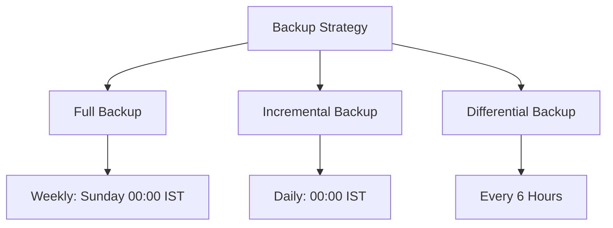

# Backup and Recovery Procedures

## Overview

This guide outlines comprehensive backup and recovery procedures for the Energy Forecast Platform, ensuring data durability and system resilience.

## Backup Strategy

### Backup Types and Schedule



### Implementation Examples

#### Automated Backup System
```python
class AutomatedBackup:
    def __init__(self):
        self.timestamp = "2024-12-08T23:44:29+05:30"
        self.backup_types = {
            "full": self.full_backup,
            "incremental": self.incremental_backup,
            "differential": self.differential_backup
        }
    
    async def execute_backup(self, backup_type: str):
        """Execute specified backup type."""
        if backup_type not in self.backup_types:
            raise ValueError(f"Invalid backup type: {backup_type}")
        
        try:
            backup_id = await self.backup_types[backup_type]()
            await self.verify_backup(backup_id)
            await self.replicate_backup(backup_id)
            return backup_id
        except Exception as e:
            await self.handle_backup_failure(backup_type, str(e))
            raise
    
    async def verify_backup(self, backup_id: str):
        """Verify backup integrity."""
        checksum = await self.calculate_checksum(backup_id)
        if not await self.validate_checksum(backup_id, checksum):
            raise BackupVerificationError(f"Backup {backup_id} verification failed")
```

#### Backup Monitoring
```python
class BackupMonitor:
    def monitor_backup_health(self) -> dict:
        """Monitor backup system health."""
        return {
            "timestamp": "2024-12-08T23:44:29+05:30",
            "metrics": {
                "success_rate": self.calculate_success_rate(),
                "backup_size": self.get_total_size(),
                "last_successful": self.get_last_successful(),
                "failed_attempts": self.get_failed_attempts()
            },
            "storage": {
                "utilization": self.get_storage_utilization(),
                "retention": self.check_retention_compliance()
            }
        }
```

## Recovery Procedures

### Recovery Types

```python
class RecoveryManager:
    async def execute_recovery(self, recovery_type: str, target_point: str):
        """Execute recovery procedure."""
        recovery_steps = {
            "point_in_time": self.point_in_time_recovery,
            "full_system": self.full_system_recovery,
            "database": self.database_recovery,
            "file_level": self.file_level_recovery
        }
        
        if recovery_type not in recovery_steps:
            raise ValueError(f"Invalid recovery type: {recovery_type}")
        
        try:
            # Pre-recovery checks
            await self.pre_recovery_check(recovery_type, target_point)
            
            # Execute recovery
            recovery_id = await recovery_steps[recovery_type](target_point)
            
            # Post-recovery validation
            await self.validate_recovery(recovery_id)
            
            return recovery_id
        except Exception as e:
            await self.handle_recovery_failure(recovery_type, str(e))
            raise
```

### Database Recovery Example
```python
class DatabaseRecovery:
    async def recover_database(self, point_in_time: str):
        """Perform database recovery."""
        recovery_plan = {
            "timestamp": point_in_time,
            "steps": [
                self.stop_applications,
                self.restore_backup,
                self.apply_transaction_logs,
                self.verify_data_integrity,
                self.update_connections
            ]
        }
        
        try:
            for step in recovery_plan["steps"]:
                await step()
            
            await self.log_recovery_success(point_in_time)
        except Exception as e:
            await self.handle_recovery_error(e)
            raise
```

## Storage Strategy

### Multi-Region Storage
```python
class StorageManager:
    def __init__(self):
        self.storage_regions = {
            "primary": "in-west-1",
            "secondary": "in-south-1",
            "dr_site": "ap-south-1"
        }
    
    async def manage_storage(self, backup_id: str):
        """Manage backup storage across regions."""
        try:
            # Store in primary region
            await self.store_backup(backup_id, self.storage_regions["primary"])
            
            # Replicate to secondary
            await self.replicate_backup(
                backup_id, 
                self.storage_regions["primary"],
                self.storage_regions["secondary"]
            )
            
            # Update storage registry
            await self.update_storage_registry(backup_id)
        except Exception as e:
            await self.handle_storage_error(e)
            raise
```

### Storage Optimization
```python
class StorageOptimizer:
    def optimize_storage(self) -> dict:
        """Optimize backup storage."""
        optimizations = {
            "deduplication": self.deduplicate_backups,
            "compression": self.compress_backups,
            "cleanup": self.cleanup_old_backups,
            "rebalancing": self.rebalance_storage
        }
        
        results = {}
        for name, optimization in optimizations.items():
            results[name] = optimization()
        
        return results
```

## Testing and Validation

### Recovery Testing
```python
class RecoveryTester:
    async def test_recovery_scenario(self, scenario: str):
        """Test recovery scenario."""
        scenarios = {
            "database_corruption": self.test_db_corruption,
            "ransomware_attack": self.test_ransomware,
            "hardware_failure": self.test_hardware_failure,
            "human_error": self.test_human_error
        }
        
        if scenario not in scenarios:
            raise ValueError(f"Invalid scenario: {scenario}")
        
        try:
            # Execute scenario
            test_id = await scenarios[scenario]()
            
            # Validate recovery
            await self.validate_recovery(test_id)
            
            # Generate report
            await self.generate_test_report(test_id)
            
            return test_id
        except Exception as e:
            await self.handle_test_failure(scenario, str(e))
            raise
```

### Automated Testing
```python
class AutomatedTester:
    def schedule_tests(self) -> dict:
        """Schedule automated recovery tests."""
        return {
            "daily_tests": [
                "backup_verification",
                "restore_validation"
            ],
            "weekly_tests": [
                "point_in_time_recovery",
                "database_recovery"
            ],
            "monthly_tests": [
                "full_system_recovery",
                "dr_simulation"
            ]
        }
```

## Monitoring and Alerts

### Performance Monitoring
```python
from prometheus_client import Counter, Histogram

# Define metrics
backup_operations = Counter(
    'backup_operations_total',
    'Total backup operations',
    ['type', 'status']
)

recovery_time = Histogram(
    'recovery_time_seconds',
    'Recovery operation duration',
    ['type']
)
```

### Alert Configuration
```python
class AlertManager:
    def configure_alerts(self) -> dict:
        """Configure backup and recovery alerts."""
        return {
            "backup_failure": {
                "severity": "critical",
                "threshold": "1 failure",
                "notification": ["email", "sms", "slack"]
            },
            "recovery_delay": {
                "severity": "high",
                "threshold": "> 30 minutes",
                "notification": ["email", "sms"]
            },
            "storage_usage": {
                "severity": "warning",
                "threshold": "> 80%",
                "notification": ["email"]
            }
        }
```

## Disaster Recovery

### DR Procedures
```python
class DisasterRecovery:
    async def execute_dr_plan(self, incident_type: str):
        """Execute disaster recovery plan."""
        dr_steps = {
            "site_failure": self.handle_site_failure,
            "data_corruption": self.handle_data_corruption,
            "cyber_attack": self.handle_cyber_attack
        }
        
        if incident_type not in dr_steps:
            raise ValueError(f"Invalid incident type: {incident_type}")
        
        try:
            # Initiate DR
            dr_id = await dr_steps[incident_type]()
            
            # Monitor progress
            await self.monitor_dr_progress(dr_id)
            
            # Validate recovery
            await self.validate_dr_recovery(dr_id)
            
            return dr_id
        except Exception as e:
            await self.handle_dr_failure(incident_type, str(e))
            raise
```

## Documentation and Reporting

### Backup Reports
```python
class BackupReporter:
    def generate_backup_report(self) -> dict:
        """Generate comprehensive backup report."""
        return {
            "timestamp": "2024-12-08T23:44:29+05:30",
            "metrics": {
                "success_rate": self.calculate_success_rate(),
                "total_size": self.calculate_total_size(),
                "backup_duration": self.calculate_duration()
            },
            "compliance": {
                "retention": self.check_retention(),
                "encryption": self.verify_encryption(),
                "replication": self.verify_replication()
            },
            "recommendations": self.generate_recommendations()
        }
```

## Related Documentation
- [Security Guide](./security_guide.md)
- [Data Privacy Compliance](./data_privacy_compliance.md)
- [Monitoring Guide](./monitoring_guide.md)
- [Infrastructure Guide](./infrastructure_guide.md)
