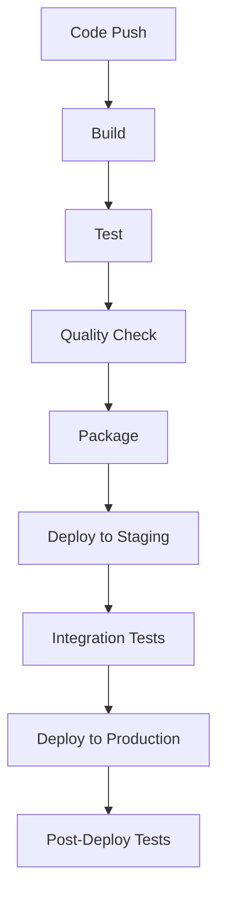

# CI/CD Pipeline Documentation

## Overview

This document outlines the Continuous Integration and Continuous Deployment (CI/CD) pipeline for the Energy Forecast Platform.

## Pipeline Architecture



## Pipeline Stages

### 1. Build Stage
```yaml
build:
  stage: build
  script:
    - python -m venv venv
    - source venv/bin/activate
    - pip install -r requirements.txt
    - python setup.py build
  artifacts:
    paths:
      - dist/
```

### 2. Test Stage
```yaml
test:
  stage: test
  script:
    - pytest tests/
    - pytest --cov=app tests/
    - pylint app/
  coverage:
    report:
      coverage_dir: coverage/
```

### 3. Quality Check
```yaml
quality:
  stage: quality
  script:
    - black --check app/
    - mypy app/
    - bandit -r app/
```

### 4. Package Stage
```yaml
package:
  stage: package
  script:
    - docker build -t energy-forecast:${CI_COMMIT_SHA} .
    - docker push energy-forecast:${CI_COMMIT_SHA}
```

## Environment Configuration

### Development
```yaml
environment:
  name: development
  url: https://dev.energyforecast.com
  deployment:
    strategy: rolling
    max_surge: 1
    max_unavailable: 0
```

### Staging
```yaml
environment:
  name: staging
  url: https://staging.energyforecast.com
  deployment:
    strategy: blue-green
    validation_period: 10m
```

### Production
```yaml
environment:
  name: production
  url: https://api.energyforecast.com
  deployment:
    strategy: canary
    steps: [10, 30, 50, 100]
    metrics:
      - error_rate
      - latency_p95
```

## Automated Tests

### Unit Tests
```python
def test_model_prediction():
    """Test model prediction accuracy."""
    assert model.predict(test_data) == expected_output
```

### Integration Tests
```python
def test_api_endpoint():
    """Test API endpoint response."""
    response = client.get("/forecast/Mumbai")
    assert response.status_code == 200
```

### Performance Tests
```python
def test_api_performance():
    """Test API performance under load."""
    results = locust.run_load_test()
    assert results.p95 < 200  # ms
```

## Deployment Strategies

### Blue-Green Deployment
1. Deploy new version (Green)
2. Run smoke tests
3. Switch traffic
4. Verify health
5. Remove old version (Blue)

### Canary Deployment
1. Deploy to 10% traffic
2. Monitor metrics
3. Gradually increase traffic
4. Full deployment
5. Cleanup

## Rollback Procedures

### Automatic Rollback
```yaml
rollback:
  triggers:
    - error_rate > 1%
    - latency_p95 > 500ms
  procedure:
    - stop_deployment
    - revert_traffic
    - restore_previous_version
```

### Manual Rollback
```bash
# Revert to previous version
kubectl rollout undo deployment/energy-forecast

# Verify rollback
kubectl rollout status deployment/energy-forecast
```

## Monitoring and Alerts

### Pipeline Metrics
- Build time
- Test coverage
- Code quality score
- Deployment time

### Deployment Metrics
- Success rate
- Rollback rate
- Time to recovery
- Deployment frequency

## Security Checks

### Static Analysis
- SAST scanning
- Dependency scanning
- Container scanning
- License compliance

### Dynamic Analysis
- DAST scanning
- API security testing
- Penetration testing

## Related Documentation
- [Deployment Guide](./deployment_guide.md)
- [Testing Guide](./testing_guide.md)
- [Security Guide](./security_guide.md)
- [Monitoring Guide](./monitoring_guide.md)
