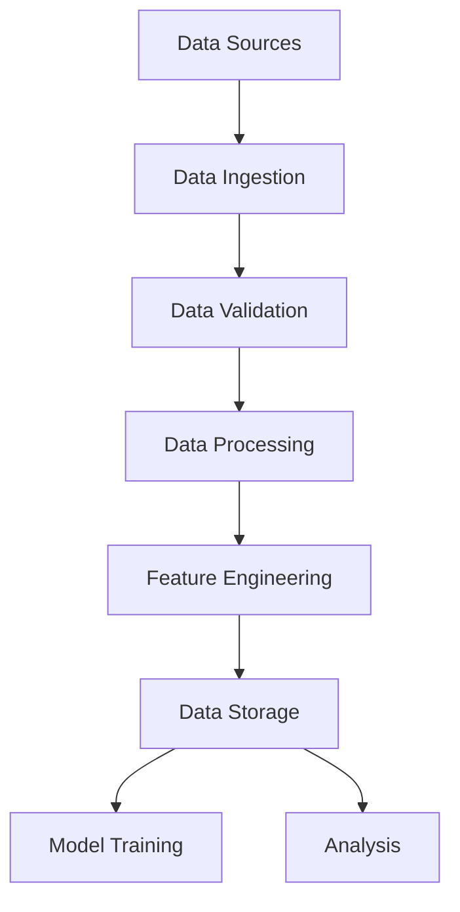

# Data Pipeline Guide

## Overview

This guide details the data pipeline architecture for the Energy Forecast Platform, covering data ingestion, processing, storage, and analysis.

## Pipeline Architecture



## Data Sources

### 1. Energy Consumption Data

```python
# core/data/sources/consumption.py
class ConsumptionDataSource:
    """Energy consumption data source."""
    
    def __init__(self, config: Dict[str, Any]):
        self.config = config
        self.client = create_database_client(config)
    
    async def fetch_data(
        self,
        start_date: datetime,
        end_date: datetime,
        cities: List[str]
    ) -> pd.DataFrame:
        """Fetch consumption data."""
        query = """
            SELECT timestamp, city, consumption_kwh
            FROM consumption_data
            WHERE timestamp BETWEEN :start_date AND :end_date
            AND city = ANY(:cities)
        """
        
        params = {
            'start_date': start_date,
            'end_date': end_date,
            'cities': cities
        }
        
        return await self.client.fetch_dataframe(query, params)
```

### 2. Weather Data

```python
# core/data/sources/weather.py
class WeatherDataSource:
    """Weather data source."""
    
    def __init__(self, config: Dict[str, Any]):
        self.config = config
        self.api_client = WeatherAPIClient(config['api_key'])
    
    async def fetch_data(
        self,
        locations: List[Dict[str, float]],
        start_date: datetime,
        end_date: datetime
    ) -> pd.DataFrame:
        """Fetch weather data."""
        data = []
        
        for location in locations:
            response = await self.api_client.get_historical_weather(
                lat=location['latitude'],
                lon=location['longitude'],
                start_date=start_date,
                end_date=end_date
            )
            
            data.extend(response['hourly'])
        
        return pd.DataFrame(data)
```

## Data Ingestion

### 1. Data Collectors

```python
# core/data/collectors.py
class DataCollector:
    """Base class for data collection."""
    
    def __init__(self):
        self.sources = self._initialize_sources()
        self.validators = self._initialize_validators()
    
    async def collect_data(
        self,
        start_date: datetime,
        end_date: datetime
    ) -> Dict[str, pd.DataFrame]:
        """Collect data from all sources."""
        tasks = []
        
        for source in self.sources:
            task = asyncio.create_task(
                source.fetch_data(start_date, end_date)
            )
            tasks.append(task)
        
        results = await asyncio.gather(*tasks)
        
        return {
            source.name: data
            for source, data in zip(self.sources, results)
        }
```

### 2. Data Validation

```python
# core/data/validators.py
class DataValidator:
    """Validate incoming data."""
    
    def __init__(self):
        self.rules = self._load_validation_rules()
    
    def validate_data(
        self,
        data: pd.DataFrame,
        schema: str
    ) -> Tuple[bool, List[str]]:
        """Validate data against schema."""
        errors = []
        
        # Check data types
        for column, dtype in self.rules[schema]['dtypes'].items():
            if data[column].dtype != dtype:
                errors.append(f"Invalid dtype for {column}")
        
        # Check value ranges
        for column, ranges in self.rules[schema]['ranges'].items():
            if not data[column].between(ranges['min'], ranges['max']).all():
                errors.append(f"Values out of range for {column}")
        
        # Check completeness
        for column in self.rules[schema]['required']:
            if data[column].isna().any():
                errors.append(f"Missing values in {column}")
        
        return len(errors) == 0, errors
```

## Data Processing

### 1. Data Cleaning

```python
# core/data/cleaning.py
class DataCleaner:
    """Clean raw data."""
    
    def __init__(self):
        self.outlier_detector = IsolationForest(contamination=0.1)
    
    def clean_data(self, data: pd.DataFrame) -> pd.DataFrame:
        """Clean raw data."""
        # Remove duplicates
        data = data.drop_duplicates()
        
        # Handle missing values
        data = self._handle_missing_values(data)
        
        # Remove outliers
        data = self._remove_outliers(data)
        
        return data
    
    def _handle_missing_values(
        self,
        data: pd.DataFrame
    ) -> pd.DataFrame:
        """Handle missing values in data."""
        # For numerical columns
        numerical_cols = data.select_dtypes(include=['float64', 'int64']).columns
        for col in numerical_cols:
            if data[col].isna().sum() / len(data) < 0.05:
                # Less than 5% missing - use interpolation
                data[col] = data[col].interpolate(method='time')
            else:
                # More than 5% missing - use advanced imputation
                imputer = IterativeImputer(random_state=42)
                data[col] = imputer.fit_transform(data[[col]])
        
        return data
    
    def _remove_outliers(
        self,
        data: pd.DataFrame
    ) -> pd.DataFrame:
        """Remove statistical outliers."""
        numerical_cols = data.select_dtypes(include=['float64', 'int64']).columns
        
        # Fit outlier detector
        outlier_labels = self.outlier_detector.fit_predict(data[numerical_cols])
        
        # Remove outliers
        return data[outlier_labels == 1]
```

### 2. Feature Engineering

```python
# core/data/features.py
class FeatureEngineer:
    """Engineer features for model training."""
    
    def __init__(self):
        self.transformers = self._initialize_transformers()
    
    def create_features(
        self,
        data: pd.DataFrame
    ) -> pd.DataFrame:
        """Create model features."""
        features = pd.DataFrame()
        
        # Time-based features
        features = features.join(self._create_time_features(data))
        
        # Weather features
        features = features.join(self._create_weather_features(data))
        
        # Lagged features
        features = features.join(self._create_lagged_features(data))
        
        # Statistical features
        features = features.join(self._create_statistical_features(data))
        
        return features
    
    def _create_time_features(
        self,
        data: pd.DataFrame
    ) -> pd.DataFrame:
        """Create time-based features."""
        return pd.DataFrame({
            'hour': data.index.hour,
            'day_of_week': data.index.dayofweek,
            'month': data.index.month,
            'is_weekend': data.index.dayofweek.isin([5, 6]),
            'is_holiday': self._is_holiday(data.index)
        })
    
    def _create_weather_features(
        self,
        data: pd.DataFrame
    ) -> pd.DataFrame:
        """Create weather-based features."""
        return pd.DataFrame({
            'temp_moving_avg_24h': data['temperature']
                .rolling(24).mean(),
            'temp_moving_std_24h': data['temperature']
                .rolling(24).std(),
            'humidity_moving_avg_24h': data['humidity']
                .rolling(24).mean()
        })
```

## Data Storage

### 1. Data Lake

```python
# core/data/storage/lake.py
class DataLake:
    """Data lake storage manager."""
    
    def __init__(self, config: Dict[str, Any]):
        self.config = config
        self.s3_client = boto3.client('s3')
    
    def store_raw_data(
        self,
        data: pd.DataFrame,
        dataset: str
    ):
        """Store raw data in data lake."""
        path = self._get_raw_data_path(dataset)
        
        # Store as parquet
        parquet_buffer = BytesIO()
        data.to_parquet(parquet_buffer)
        
        self.s3_client.put_object(
            Bucket=self.config['bucket'],
            Key=path,
            Body=parquet_buffer.getvalue()
        )
    
    def store_processed_data(
        self,
        data: pd.DataFrame,
        dataset: str
    ):
        """Store processed data in data lake."""
        path = self._get_processed_data_path(dataset)
        
        # Store as parquet with compression
        parquet_buffer = BytesIO()
        data.to_parquet(
            parquet_buffer,
            compression='snappy',
            index=True
        )
        
        self.s3_client.put_object(
            Bucket=self.config['bucket'],
            Key=path,
            Body=parquet_buffer.getvalue()
        )
```

### 2. Feature Store

```python
# core/data/storage/feature_store.py
class FeatureStore:
    """Feature store manager."""
    
    def __init__(self, config: Dict[str, Any]):
        self.config = config
        self.redis_client = Redis(**config['redis'])
    
    def store_features(
        self,
        features: pd.DataFrame,
        feature_group: str
    ):
        """Store features in feature store."""
        # Convert to dictionary format
        feature_dict = features.to_dict(orient='records')
        
        # Store features with TTL
        pipeline = self.redis_client.pipeline()
        
        for record in feature_dict:
            key = self._get_feature_key(
                feature_group,
                record['timestamp']
            )
            pipeline.setex(
                key,
                self.config['ttl'],
                json.dumps(record)
            )
        
        pipeline.execute()
    
    def get_features(
        self,
        feature_group: str,
        start_time: datetime,
        end_time: datetime
    ) -> pd.DataFrame:
        """Retrieve features from feature store."""
        keys = self._get_feature_keys(
            feature_group,
            start_time,
            end_time
        )
        
        # Fetch features
        pipeline = self.redis_client.pipeline()
        for key in keys:
            pipeline.get(key)
        
        results = pipeline.execute()
        
        # Convert to DataFrame
        features = []
        for result in results:
            if result:
                features.append(json.loads(result))
        
        return pd.DataFrame(features)
```

## Data Analysis

### 1. Data Quality Analysis

```python
# core/data/analysis/quality.py
class DataQualityAnalyzer:
    """Analyze data quality."""
    
    def analyze_quality(
        self,
        data: pd.DataFrame
    ) -> Dict[str, Any]:
        """Analyze data quality metrics."""
        return {
            'completeness': self._analyze_completeness(data),
            'accuracy': self._analyze_accuracy(data),
            'consistency': self._analyze_consistency(data),
            'timeliness': self._analyze_timeliness(data)
        }
    
    def _analyze_completeness(
        self,
        data: pd.DataFrame
    ) -> Dict[str, float]:
        """Analyze data completeness."""
        return {
            'overall': 1 - data.isna().sum().sum() / (data.shape[0] * data.shape[1]),
            'by_column': {
                col: 1 - data[col].isna().sum() / len(data)
                for col in data.columns
            }
        }
```

### 2. Performance Analysis

```python
# core/data/analysis/performance.py
class PipelinePerformanceAnalyzer:
    """Analyze pipeline performance."""
    
    def __init__(self):
        self.metrics_client = PrometheusClient()
    
    def record_performance(
        self,
        stage: str,
        start_time: float,
        end_time: float,
        data_size: int
    ):
        """Record pipeline performance metrics."""
        duration = end_time - start_time
        
        self.metrics_client.histogram(
            'pipeline_duration_seconds',
            duration,
            labels={'stage': stage}
        )
        
        self.metrics_client.gauge(
            'pipeline_data_size',
            data_size,
            labels={'stage': stage}
        )
        
        self.metrics_client.gauge(
            'pipeline_throughput',
            data_size / duration,
            labels={'stage': stage}
        )
```

## Pipeline Orchestration

### 1. Pipeline Scheduler

```python
# core/data/orchestration/scheduler.py
class PipelineScheduler:
    """Schedule and orchestrate data pipeline."""
    
    def __init__(self):
        self.scheduler = AsyncIOScheduler()
        self.logger = logging.getLogger(__name__)
    
    def schedule_pipeline(
        self,
        pipeline: DataPipeline,
        schedule: Dict[str, Any]
    ):
        """Schedule pipeline execution."""
        self.scheduler.add_job(
            pipeline.execute,
            'cron',
            **schedule,
            id=f'pipeline_{pipeline.name}',
            replace_existing=True
        )
    
    async def start(self):
        """Start scheduler."""
        self.scheduler.start()
        self.logger.info("Pipeline scheduler started")
```

### 2. Pipeline Monitoring

```python
# core/data/orchestration/monitoring.py
class PipelineMonitor:
    """Monitor pipeline execution."""
    
    def __init__(self):
        self.metrics_client = PrometheusClient()
        self.alert_client = AlertManager()
    
    def monitor_pipeline(
        self,
        pipeline: DataPipeline
    ):
        """Monitor pipeline execution."""
        # Record pipeline status
        self.metrics_client.gauge(
            'pipeline_status',
            pipeline.status.value,
            labels={'name': pipeline.name}
        )
        
        # Check for failures
        if pipeline.status == PipelineStatus.FAILED:
            self.alert_client.send_alert(
                title=f"Pipeline {pipeline.name} failed",
                description=pipeline.error_message,
                severity="high"
            )
        
        # Record data quality metrics
        quality_metrics = pipeline.get_quality_metrics()
        for metric, value in quality_metrics.items():
            self.metrics_client.gauge(
                'data_quality',
                value,
                labels={
                    'pipeline': pipeline.name,
                    'metric': metric
                }
            )
```

This comprehensive guide details the entire data pipeline architecture of the Energy Forecast Platform, from data ingestion to analysis and monitoring.
