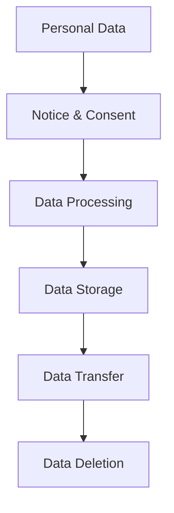

# Data Privacy and Compliance Guide

## Overview

This guide outlines the data privacy and compliance requirements for the Energy Forecast Platform, with specific focus on Indian regulations and international standards.

## Regulatory Framework

### Indian Regulations

#### Digital Personal Data Protection Act (DPDP), 2023


Requirements:
- Explicit user consent
- Purpose limitation
- Data minimization
- Storage limitation
- Transfer restrictions

#### Implementation Examples
```python
class DPDPCompliance:
    def __init__(self):
        self.consent_manager = ConsentManager()
        self.data_processor = DataProcessor()
    
    async def process_user_data(self, user_id: str, data: dict):
        """Process user data in compliance with DPDP."""
        # Check consent
        if not await self.consent_manager.has_valid_consent(user_id):
            raise ConsentError("Valid consent not found")
        
        # Verify purpose limitation
        if not self.validate_purpose(data["purpose"]):
            raise PurposeError("Invalid processing purpose")
        
        # Apply data minimization
        filtered_data = self.minimize_data(data)
        
        # Process with storage limits
        await self.data_processor.process_with_retention(filtered_data)
        
        # Log processing activity
        await self.log_processing_activity(user_id, data["purpose"])

    def minimize_data(self, data: dict) -> dict:
        """Apply data minimization principles."""
        essential_fields = {
            "consumption_data": ["timestamp", "value", "unit"],
            "location_data": ["city", "zone"],
            "user_data": ["id", "category"]
        }
        
        return {k: {f: data[k][f] for f in v if f in data[k]}
                for k, v in essential_fields.items() if k in data}
```

#### Electricity Act, 2003 Compliance
```python
class GridDataProtection:
    def protect_grid_data(self, data: dict) -> dict:
        """Implement grid data protection requirements."""
        sensitive_params = {
            "grid_capacity": self.mask_capacity,
            "load_distribution": self.aggregate_load,
            "infrastructure_details": self.sanitize_infrastructure
        }
        
        return {k: sensitive_params[k](v) if k in sensitive_params else v
                for k, v in data.items()}
    
    def mask_capacity(self, value: float) -> str:
        """Mask grid capacity data."""
        return f"{round(value, -2)}±50 MW"
    
    def aggregate_load(self, data: list) -> dict:
        """Aggregate load distribution data."""
        return {
            "peak_load": sum(d["load"] for d in data),
            "average_load": statistics.mean(d["load"] for d in data),
            "time_period": f"{data[0]['time']} to {data[-1]['time']}"
        }
```

### Data Localization Requirements

#### Storage Requirements
```python
class DataLocalization:
    def __init__(self):
        self.storage_zones = {
            "critical": ["in-west-1", "in-south-1"],
            "sensitive": ["in-west-1", "ap-south-1"],
            "general": ["ap-south-1", "ap-southeast-1"]
        }
    
    async def store_data(self, data: dict, classification: str):
        """Store data according to localization requirements."""
        zones = self.storage_zones[classification]
        
        # Primary storage
        await self.store_in_zone(data, zones[0])
        
        # Backup storage
        if len(zones) > 1:
            await self.store_in_zone(data, zones[1])
        
        # Update storage registry
        await self.update_registry(data["id"], zones)
```

## Enhanced Consent Management

### Granular Consent
```python
class GranularConsent:
    def collect_detailed_consent(self, user_id: str) -> dict:
        """Collect granular user consent."""
        consent_items = {
            "basic_data": {
                "description": "Basic energy consumption data",
                "retention": "2 years",
                "usage": ["billing", "forecasting"]
            },
            "advanced_analytics": {
                "description": "Detailed consumption patterns",
                "retention": "1 year",
                "usage": ["optimization", "recommendations"]
            },
            "location_data": {
                "description": "Geographic location for zone-based analysis",
                "retention": "1 year",
                "usage": ["zone_planning"]
            }
        }
        
        return self.record_consent_choices(user_id, consent_items)
```

### Consent Lifecycle
```python
class ConsentLifecycle:
    def __init__(self):
        self.timestamp = "2024-12-08T23:44:29+05:30"
    
    async def manage_consent_lifecycle(self, user_id: str):
        """Manage consent throughout its lifecycle."""
        # Initial consent
        consent = await self.collect_initial_consent(user_id)
        
        # Regular renewal
        if self.needs_renewal(consent):
            await self.renew_consent(user_id)
        
        # Handle withdrawal
        if self.check_withdrawal_request(user_id):
            await self.process_withdrawal(user_id)
        
        # Update audit trail
        await self.update_consent_audit(user_id)
```

## Data Subject Rights Implementation

### Rights Management
```python
class DataSubjectRights:
    async def handle_right_request(self, user_id: str, right_type: str):
        """Handle data subject right requests."""
        handlers = {
            "access": self.provide_data_access,
            "rectification": self.rectify_data,
            "erasure": self.erase_data,
            "portability": self.provide_portable_data,
            "restrict": self.restrict_processing
        }
        
        if right_type in handlers:
            await handlers[right_type](user_id)
            await self.log_right_exercise(user_id, right_type)
```

## Audit and Compliance Reporting

### Automated Auditing
```python
class ComplianceAuditor:
    def generate_compliance_report(self) -> dict:
        """Generate comprehensive compliance report."""
        return {
            "timestamp": "2024-12-08T23:44:29+05:30",
            "data_inventory": self.audit_data_inventory(),
            "consent_status": self.audit_consent_records(),
            "processing_activities": self.audit_processing_logs(),
            "data_transfers": self.audit_data_transfers(),
            "security_measures": self.audit_security_controls()
        }
```

## Related Documentation
- [Security Guide](./security_guide.md)
- [Backup and Recovery](./backup_recovery_procedures.md)
- [API Security](./api_reference.md#security)
- [Monitoring Guide](./monitoring_guide.md)
