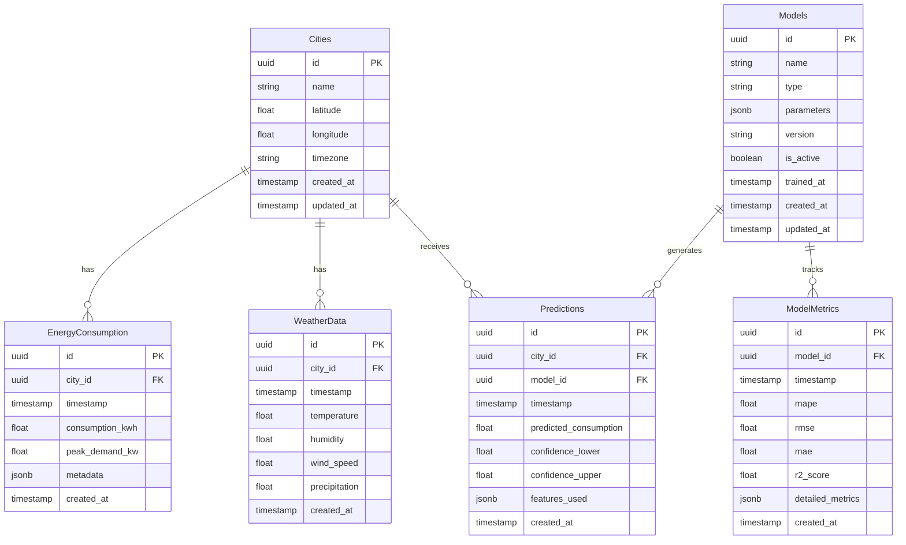

# Database Schema Guide

## Overview

This guide documents the database schema design for the Energy Forecast Platform, including tables, relationships, indexes, and optimization strategies.

## Schema Diagram



## Table Definitions

### 1. Cities

```sql
CREATE TABLE cities (
    id UUID PRIMARY KEY DEFAULT gen_random_uuid(),
    name VARCHAR(100) NOT NULL,
    latitude DECIMAL(9,6) NOT NULL,
    longitude DECIMAL(9,6) NOT NULL,
    timezone VARCHAR(50) NOT NULL,
    metadata JSONB DEFAULT '{}',
    created_at TIMESTAMP WITH TIME ZONE DEFAULT CURRENT_TIMESTAMP,
    updated_at TIMESTAMP WITH TIME ZONE DEFAULT CURRENT_TIMESTAMP,
    CONSTRAINT unique_city_name UNIQUE (name)
);

-- Indexes
CREATE INDEX idx_cities_location ON cities USING gist (
    ll_to_earth(latitude, longitude)
);
CREATE INDEX idx_cities_timezone ON cities (timezone);
```

### 2. Energy Consumption

```sql
CREATE TABLE energy_consumption (
    id UUID PRIMARY KEY DEFAULT gen_random_uuid(),
    city_id UUID NOT NULL REFERENCES cities(id),
    timestamp TIMESTAMP WITH TIME ZONE NOT NULL,
    consumption_kwh DECIMAL(12,2) NOT NULL,
    peak_demand_kw DECIMAL(12,2),
    metadata JSONB DEFAULT '{}',
    created_at TIMESTAMP WITH TIME ZONE DEFAULT CURRENT_TIMESTAMP,
    CONSTRAINT consumption_city_timestamp UNIQUE (city_id, timestamp)
);

-- Indexes
CREATE INDEX idx_consumption_city_time ON energy_consumption (city_id, timestamp);
CREATE INDEX idx_consumption_time ON energy_consumption USING BRIN (timestamp);
```

### 3. Weather Data

```sql
CREATE TABLE weather_data (
    id UUID PRIMARY KEY DEFAULT gen_random_uuid(),
    city_id UUID NOT NULL REFERENCES cities(id),
    timestamp TIMESTAMP WITH TIME ZONE NOT NULL,
    temperature DECIMAL(5,2) NOT NULL,
    humidity DECIMAL(5,2),
    wind_speed DECIMAL(5,2),
    precipitation DECIMAL(5,2),
    created_at TIMESTAMP WITH TIME ZONE DEFAULT CURRENT_TIMESTAMP,
    CONSTRAINT weather_city_timestamp UNIQUE (city_id, timestamp)
);

-- Indexes
CREATE INDEX idx_weather_city_time ON weather_data (city_id, timestamp);
CREATE INDEX idx_weather_time ON weather_data USING BRIN (timestamp);
```

### 4. Models

```sql
CREATE TABLE models (
    id UUID PRIMARY KEY DEFAULT gen_random_uuid(),
    name VARCHAR(100) NOT NULL,
    type VARCHAR(50) NOT NULL,
    parameters JSONB NOT NULL DEFAULT '{}',
    version VARCHAR(20) NOT NULL,
    is_active BOOLEAN DEFAULT false,
    trained_at TIMESTAMP WITH TIME ZONE,
    created_at TIMESTAMP WITH TIME ZONE DEFAULT CURRENT_TIMESTAMP,
    updated_at TIMESTAMP WITH TIME ZONE DEFAULT CURRENT_TIMESTAMP,
    CONSTRAINT unique_model_version UNIQUE (name, version)
);

-- Indexes
CREATE INDEX idx_models_active ON models (is_active) WHERE is_active = true;
CREATE INDEX idx_models_type ON models (type);
```

### 5. Predictions

```sql
CREATE TABLE predictions (
    id UUID PRIMARY KEY DEFAULT gen_random_uuid(),
    city_id UUID NOT NULL REFERENCES cities(id),
    model_id UUID NOT NULL REFERENCES models(id),
    timestamp TIMESTAMP WITH TIME ZONE NOT NULL,
    predicted_consumption DECIMAL(12,2) NOT NULL,
    confidence_lower DECIMAL(12,2),
    confidence_upper DECIMAL(12,2),
    features_used JSONB DEFAULT '{}',
    created_at TIMESTAMP WITH TIME ZONE DEFAULT CURRENT_TIMESTAMP,
    CONSTRAINT prediction_city_model_time UNIQUE (city_id, model_id, timestamp)
);

-- Indexes
CREATE INDEX idx_predictions_city_time ON predictions (city_id, timestamp);
CREATE INDEX idx_predictions_model ON predictions (model_id);
CREATE INDEX idx_predictions_time ON predictions USING BRIN (timestamp);
```

### 6. Model Metrics

```sql
CREATE TABLE model_metrics (
    id UUID PRIMARY KEY DEFAULT gen_random_uuid(),
    model_id UUID NOT NULL REFERENCES models(id),
    timestamp TIMESTAMP WITH TIME ZONE NOT NULL,
    mape DECIMAL(8,4),
    rmse DECIMAL(12,2),
    mae DECIMAL(12,2),
    r2_score DECIMAL(8,4),
    detailed_metrics JSONB DEFAULT '{}',
    created_at TIMESTAMP WITH TIME ZONE DEFAULT CURRENT_TIMESTAMP,
    CONSTRAINT metrics_model_time UNIQUE (model_id, timestamp)
);

-- Indexes
CREATE INDEX idx_metrics_model_time ON model_metrics (model_id, timestamp);
CREATE INDEX idx_metrics_time ON model_metrics USING BRIN (timestamp);
```

## Common Queries

### 1. Recent Energy Consumption

```sql
-- Get hourly consumption for last 24 hours
SELECT 
    date_trunc('hour', timestamp) as hour,
    sum(consumption_kwh) as total_consumption,
    max(peak_demand_kw) as peak_demand
FROM energy_consumption
WHERE 
    city_id = :city_id
    AND timestamp >= now() - interval '24 hours'
GROUP BY 1
ORDER BY 1;
```

### 2. Weather Correlation

```sql
-- Analyze consumption vs weather
SELECT 
    w.temperature,
    avg(e.consumption_kwh) as avg_consumption,
    count(*) as sample_count
FROM energy_consumption e
JOIN weather_data w ON 
    e.city_id = w.city_id 
    AND date_trunc('hour', e.timestamp) = date_trunc('hour', w.timestamp)
WHERE 
    e.city_id = :city_id
    AND e.timestamp >= now() - interval '30 days'
GROUP BY 1
ORDER BY 1;
```

### 3. Model Performance

```sql
-- Compare model performance
SELECT 
    m.name,
    m.version,
    avg(mm.mape) as avg_mape,
    avg(mm.rmse) as avg_rmse,
    count(*) as prediction_count
FROM models m
JOIN model_metrics mm ON m.id = mm.model_id
WHERE 
    mm.timestamp >= now() - interval '7 days'
GROUP BY 1, 2
ORDER BY avg_mape;
```

## Partitioning Strategy

### 1. Time-based Partitioning

```sql
-- Partition energy consumption by month
CREATE TABLE energy_consumption (
    id UUID NOT NULL,
    city_id UUID NOT NULL,
    timestamp TIMESTAMP WITH TIME ZONE NOT NULL,
    consumption_kwh DECIMAL(12,2) NOT NULL,
    peak_demand_kw DECIMAL(12,2),
    metadata JSONB DEFAULT '{}',
    created_at TIMESTAMP WITH TIME ZONE DEFAULT CURRENT_TIMESTAMP
) PARTITION BY RANGE (timestamp);

-- Create monthly partitions
CREATE TABLE energy_consumption_y2024m01 PARTITION OF energy_consumption
    FOR VALUES FROM ('2024-01-01') TO ('2024-02-01');

CREATE TABLE energy_consumption_y2024m02 PARTITION OF energy_consumption
    FOR VALUES FROM ('2024-02-01') TO ('2024-03-01');
```

### 2. City-based Partitioning

```sql
-- Partition predictions by city
CREATE TABLE predictions (
    id UUID NOT NULL,
    city_id UUID NOT NULL,
    model_id UUID NOT NULL,
    timestamp TIMESTAMP WITH TIME ZONE NOT NULL,
    predicted_consumption DECIMAL(12,2) NOT NULL,
    confidence_lower DECIMAL(12,2),
    confidence_upper DECIMAL(12,2),
    features_used JSONB DEFAULT '{}'
) PARTITION BY LIST (city_id);

-- Create city-specific partitions
CREATE TABLE predictions_mumbai PARTITION OF predictions
    FOR VALUES IN ('city-uuid-mumbai');

CREATE TABLE predictions_delhi PARTITION OF predictions
    FOR VALUES IN ('city-uuid-delhi');
```

## Maintenance Procedures

### 1. Vacuum and Analyze

```sql
-- Regular maintenance script
DO $$
DECLARE
    table_name text;
BEGIN
    FOR table_name IN 
        SELECT tablename 
        FROM pg_tables 
        WHERE schemaname = 'public'
    LOOP
        EXECUTE format('VACUUM ANALYZE %I', table_name);
    END LOOP;
END $$;
```

### 2. Data Retention

```sql
-- Delete old data
CREATE OR REPLACE PROCEDURE cleanup_old_data()
LANGUAGE plpgsql
AS $$
BEGIN
    -- Delete old consumption data
    DELETE FROM energy_consumption
    WHERE timestamp < now() - interval '2 years';
    
    -- Delete old weather data
    DELETE FROM weather_data
    WHERE timestamp < now() - interval '2 years';
    
    -- Delete old predictions
    DELETE FROM predictions
    WHERE timestamp < now() - interval '1 year';
    
    -- Delete old metrics
    DELETE FROM model_metrics
    WHERE timestamp < now() - interval '1 year';
END;
$$;
```

## Backup Strategy

### 1. Logical Backups

```bash
#!/bin/bash
# backup_script.sh

# Set variables
BACKUP_DIR="/backups/postgres"
TIMESTAMP=$(date +%Y%m%d_%H%M%S)

# Create backup
pg_dump -Fc energy_forecast > "$BACKUP_DIR/energy_forecast_$TIMESTAMP.dump"

# Cleanup old backups
find "$BACKUP_DIR" -type f -mtime +7 -delete
```

### 2. Point-in-Time Recovery

```sql
-- Enable WAL archiving
ALTER SYSTEM SET wal_level = replica;
ALTER SYSTEM SET archive_mode = on;
ALTER SYSTEM SET archive_command = 'cp %p /archive/%f';

-- Create restore point
SELECT pg_create_restore_point('daily_backup_2024_12_08');
```

## Performance Optimization

### 1. Query Optimization

```sql
-- Create materialized view for common queries
CREATE MATERIALIZED VIEW hourly_consumption AS
SELECT 
    city_id,
    date_trunc('hour', timestamp) as hour,
    sum(consumption_kwh) as total_consumption,
    max(peak_demand_kw) as peak_demand
FROM energy_consumption
WHERE timestamp >= now() - interval '30 days'
GROUP BY 1, 2;

-- Refresh materialized view
CREATE OR REPLACE PROCEDURE refresh_materialized_views()
LANGUAGE plpgsql
AS $$
BEGIN
    REFRESH MATERIALIZED VIEW CONCURRENTLY hourly_consumption;
END;
$$;
```

### 2. Index Optimization

```sql
-- Create partial indexes
CREATE INDEX idx_active_predictions ON predictions (timestamp)
WHERE timestamp >= now() - interval '24 hours';

-- Create expression indexes
CREATE INDEX idx_hour_of_day ON energy_consumption (
    extract(hour from timestamp)
);
```

## Security

### 1. Row-Level Security

```sql
-- Enable RLS
ALTER TABLE energy_consumption ENABLE ROW LEVEL SECURITY;

-- Create policies
CREATE POLICY city_access ON energy_consumption
    FOR ALL
    TO energy_forecast_app
    USING (city_id IN (
        SELECT city_id 
        FROM user_city_access 
        WHERE user_id = current_user
    ));
```

### 2. Audit Logging

```sql
-- Create audit log table
CREATE TABLE audit_log (
    id UUID PRIMARY KEY DEFAULT gen_random_uuid(),
    table_name TEXT NOT NULL,
    action TEXT NOT NULL,
    old_data JSONB,
    new_data JSONB,
    user_name TEXT NOT NULL,
    timestamp TIMESTAMP WITH TIME ZONE DEFAULT CURRENT_TIMESTAMP
);

-- Create audit trigger
CREATE OR REPLACE FUNCTION audit_trigger_func()
RETURNS TRIGGER AS $$
BEGIN
    INSERT INTO audit_log (
        table_name,
        action,
        old_data,
        new_data,
        user_name
    ) VALUES (
        TG_TABLE_NAME,
        TG_OP,
        row_to_json(OLD),
        row_to_json(NEW),
        current_user
    );
    RETURN NULL;
END;
$$ LANGUAGE plpgsql;
```

## Additional Resources

- [API Documentation](./api_reference.md)
- [Performance Guide](./performance_optimization.md)
- [Development Setup](./development_setup.md)
- [Deployment Guide](./deployment_guide.md)
