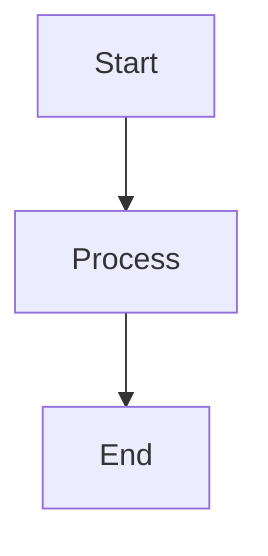
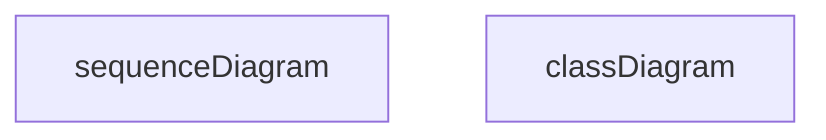

# Documentation Style Guide

## Overview

This style guide ensures consistency across the Energy Forecast Platform documentation. Follow these guidelines when creating or updating documentation.

## Document Structure

### Required Sections

1. **Title**
   ```markdown
   # Document Title
   ```

2. **Overview**
   - Brief introduction
   - Purpose of the document
   - Target audience

3. **Table of Contents** (for documents > 500 lines)
   ```markdown
   ## Table of Contents
   - [Section 1](#section-1)
   - [Section 2](#section-2)
   ```

4. **Related Documentation**
   - Links to related docs
   - Brief description of relationships

### Optional Sections

- Prerequisites
- Quick Start
- Examples
- Troubleshooting
- FAQ
- Additional Resources

## Formatting Guidelines

### Headers

```markdown
# H1 - Document Title (only one per document)
## H2 - Major sections
### H3 - Subsections
#### H4 - Detailed points
```

### Code Blocks

1. **Inline Code**
   ```markdown
   Use `backticks` for inline code, commands, or parameters
   ```

2. **Code Blocks**
   ```markdown
   ```python
   def example_function():
       return "Use language-specific code blocks"
   ```
   ```

3. **Shell Commands**
   ```markdown
   ```bash
   $ python manage.py runserver
   ```
   ```

### Lists

1. **Ordered Lists**
   ```markdown
   1. First item
   2. Second item
      a. Sub-item
      b. Sub-item
   ```

2. **Unordered Lists**
   ```markdown
   - Main point
     - Sub-point
       - Further detail
   ```

### Tables

```markdown
| Header 1 | Header 2 |
|----------|----------|
| Cell 1   | Cell 2   |
```

### Links

1. **Internal Links**
   ```markdown
   [Link Text](./relative/path/to/file.md)
   ```

2. **Section Links**
   ```markdown
   [Link to Section](#section-name)
   ```

### Diagrams

Use Mermaid for diagrams:
```markdown

```

## Writing Style

### Voice and Tone

- Use active voice
- Be concise and clear
- Maintain professional tone
- Write in present tense
- Use second person ("you")

### Technical Writing

1. **Clarity**
   - One idea per sentence
   - Short paragraphs
   - Clear examples

2. **Consistency**
   - Use consistent terminology
   - Maintain naming conventions
   - Follow version references

3. **Completeness**
   - Include all necessary steps
   - Provide context
   - Link to prerequisites

## Terminology

### Standard Terms

- "Energy Forecast Platform" (not "the platform" or "EFP")
- "Machine Learning Models" (not "ML models" or "algorithms")
- "API Endpoint" (not "route" or "URL")

### Version References

- Use semantic versioning (v1.2.3)
- Include version compatibility notes
- Mark deprecated features

## Examples and Code

### Code Examples

1. **Structure**
   ```python
   # Clear comment explaining purpose
   def example_function():
       """Docstring with clear description."""
       return result
   ```

2. **Variables**
   - Use descriptive names
   - Follow Python naming conventions
   - Include type hints

### API Examples

```markdown
### Endpoint: /api/v1/forecast

Request:
```json
{
    "city": "Mumbai",
    "date": "2024-12-08"
}
```

Response:
```json
{
    "forecast": 125.7,
    "unit": "MWh"
}
```
```

## Review Process

1. **Self-Review**
   - Check spelling and grammar
   - Verify code examples
   - Test all links
   - Validate diagrams

2. **Peer Review**
   - Technical accuracy
   - Clarity and completeness
   - Style guide compliance
   - Cross-reference validity

## Maintenance

### Regular Updates

- Review quarterly
- Update version references
- Check for deprecated content
- Verify external links

### Version Control

- Document significant changes
- Update last modified date
- Maintain changelog
- Tag documentation versions

## Tools and Resources

### Recommended Tools

- VS Code with Markdown extensions
- Mermaid for diagrams
- Markdown linters
- Spell checkers

### Templates

Located in `/docs/templates`:
- Basic document
- API reference
- Tutorial
- Troubleshooting guide

## Quick Reference

### Common Markdown

```markdown
**Bold text**
*Italic text*
`Code snippet`
> Blockquote
[Link](url)

```

### Common Mermaid

```markdown

```

## Questions and Support

For documentation questions:
1. Check existing docs
2. Review style guide
3. Ask in #documentation channel
4. Open documentation issue
