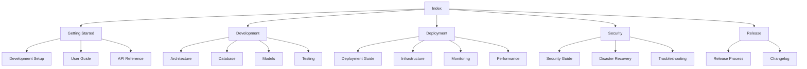

# Energy Forecast Platform Documentation

## Overview

Welcome to the Energy Forecast Platform documentation. This comprehensive guide covers all aspects of the platform, from development to deployment and maintenance.

## Quick Links

### Getting Started
- [Development Setup](./development_setup.md)
- [User Guide](./user_guide.md)
- [API Reference](./api_reference.md)

### Development
- [Architecture Overview](./architecture_overview.md)
- [Database Schema](./database_schema.md)
- [Model Training Guide](./model_training_guide.md)
- [Testing Guide](./testing_guide.md)
- [Contribution Guide](./contribution_guide.md)

### Deployment & Operations
- [Deployment Guide](./deployment_guide.md)
- [Infrastructure Guide](./infrastructure_guide.md)
- [Monitoring Guide](./monitoring_guide.md)
- [Performance Optimization](./performance_optimization.md)

### Security & Maintenance
- [Security Guide](./security_guide.md)
- [Disaster Recovery Guide](./disaster_recovery_guide.md)
- [Troubleshooting Guide](./troubleshooting_guide.md)

### Release Management
- [Release Process](./release_process.md)
- [Changelog](./changelog.md)

## Documentation Structure

## Recent Updates

| Document | Last Updated | Major Changes |
|----------|--------------|---------------|
| API Reference | 2024-12-08 | Combined API documentation |
| Testing Guide | 2024-12-08 | Merged testing guides |
| Deployment Guide | 2024-12-08 | Consolidated deployment docs |
| Architecture Overview | 2024-12-08 | Added system diagrams |
| Model Training Guide | 2024-12-08 | Added performance metrics |

## Contributing to Documentation

1. **Structure**: Each document should have:
   - Clear overview
   - Table of contents
   - Detailed sections
   - Code examples where relevant
   - Links to related docs

2. **Style Guide**:
   - Use markdown formatting
   - Include diagrams where helpful
   - Keep code examples up to date
   - Use consistent terminology

3. **Updates**:
   - Update the changelog
   - Maintain version history
   - Review cross-references
   - Test all links

## Support

For documentation issues or suggestions:
1. Open an issue in the repository
2. Tag with 'documentation'
3. Provide specific examples
4. Suggest improvements

## License

This documentation is licensed under the same terms as the Energy Forecast Platform.
