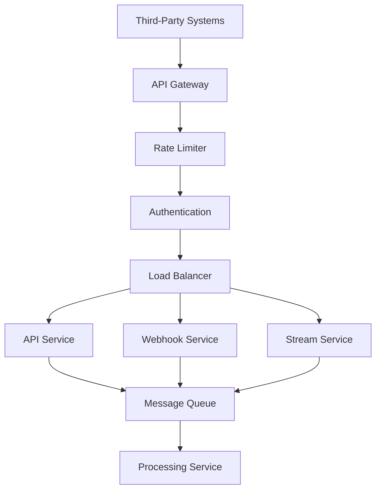

# Integration Guide

## Overview

This guide outlines the integration patterns, APIs, and examples for connecting third-party systems with the Energy Forecast Platform.

## Integration Architecture



## Integration Methods

### 1. REST API Integration

#### Authentication
```python
import requests

def get_auth_token():
    """Get authentication token."""
    response = requests.post(
        "https://api.energyforecast.com/v1/auth/token",
        json={
            "client_id": "your_client_id",
            "client_secret": "your_client_secret",
            "grant_type": "client_credentials"
        }
    )
    return response.json()["access_token"]

def make_api_request():
    """Make authenticated API request."""
    token = get_auth_token()
    headers = {
        "Authorization": f"Bearer {token}",
        "Content-Type": "application/json"
    }
    
    response = requests.get(
        "https://api.energyforecast.com/v1/forecast/Mumbai",
        headers=headers
    )
    return response.json()
```

### 2. Webhook Integration

#### Webhook Registration
```python
def register_webhook():
    """Register webhook endpoint."""
    webhook_config = {
        "url": "https://your-service.com/webhook",
        "events": ["forecast.ready", "alert.triggered"],
        "secret": generate_webhook_secret(),
        "metadata": {
            "service": "demand_planning",
            "version": "1.0"
        }
    }
    
    response = requests.post(
        "https://api.energyforecast.com/v1/webhooks",
        json=webhook_config,
        headers={"Authorization": f"Bearer {token}"}
    )
    return response.json()
```

#### Webhook Handler
```python
from fastapi import FastAPI, Request, HTTPException
import hmac
import hashlib

app = FastAPI()

@app.post("/webhook")
async def handle_webhook(request: Request):
    """Handle incoming webhook events."""
    payload = await request.json()
    signature = request.headers.get("X-Webhook-Signature")
    
    if not verify_signature(payload, signature):
        raise HTTPException(status_code=401)
    
    event_type = payload["event"]
    if event_type == "forecast.ready":
        await process_forecast(payload["data"])
    elif event_type == "alert.triggered":
        await handle_alert(payload["data"])
```

### 3. Stream Processing

#### Kafka Consumer
```python
from kafka import KafkaConsumer
import json

def setup_consumer():
    """Setup Kafka consumer for real-time data."""
    consumer = KafkaConsumer(
        'energy.consumption',
        bootstrap_servers=['kafka:9092'],
        security_protocol="SASL_SSL",
        sasl_mechanism="PLAIN",
        sasl_plain_username="your_username",
        sasl_plain_password="your_password",
        value_deserializer=lambda x: json.loads(x.decode('utf-8'))
    )
    
    for message in consumer:
        process_consumption_data(message.value)
```

#### Stream Processing
```python
async def process_consumption_data(data: dict):
    """Process real-time consumption data."""
    try:
        # Validate data
        validated_data = validate_consumption_data(data)
        
        # Transform data
        transformed_data = transform_for_processing(validated_data)
        
        # Process data
        await process_data_batch(transformed_data)
        
    except Exception as e:
        logger.error(f"Stream processing error: {e}")
        await handle_processing_error(data, e)
```

## Integration Patterns

### 1. Event-Driven Integration

```python
class EventProcessor:
    def __init__(self):
        self.handlers = {}
    
    def register_handler(self, event_type: str, handler: callable):
        """Register event handler."""
        self.handlers[event_type] = handler
    
    async def process_event(self, event: dict):
        """Process incoming event."""
        event_type = event["type"]
        if event_type in self.handlers:
            await self.handlers[event_type](event["data"])
        else:
            logger.warning(f"No handler for event type: {event_type}")
```

### 2. Batch Processing

```python
class BatchProcessor:
    def __init__(self, batch_size: int = 1000):
        self.batch_size = batch_size
        self.batch = []
    
    async def add_to_batch(self, item: dict):
        """Add item to batch."""
        self.batch.append(item)
        if len(self.batch) >= self.batch_size:
            await self.process_batch()
    
    async def process_batch(self):
        """Process batch of items."""
        try:
            await send_batch_to_api(self.batch)
            self.batch = []
        except Exception as e:
            logger.error(f"Batch processing error: {e}")
            await handle_batch_error(self.batch, e)
```

## Security Considerations

### API Security
```python
class SecurityMiddleware:
    async def __call__(self, request: Request):
        """Validate API security requirements."""
        # Verify API key
        api_key = request.headers.get("X-API-Key")
        if not verify_api_key(api_key):
            raise HTTPException(status_code=401)
        
        # Rate limiting
        if is_rate_limited(api_key):
            raise HTTPException(status_code=429)
        
        # IP whitelist
        client_ip = request.client.host
        if not is_ip_allowed(client_ip):
            raise HTTPException(status_code=403)
```

### Data Encryption
```python
from cryptography.fernet import Fernet

class DataEncryption:
    def __init__(self):
        self.key = Fernet.generate_key()
        self.cipher_suite = Fernet(self.key)
    
    def encrypt_payload(self, data: dict) -> bytes:
        """Encrypt data payload."""
        return self.cipher_suite.encrypt(
            json.dumps(data).encode()
        )
    
    def decrypt_payload(self, encrypted_data: bytes) -> dict:
        """Decrypt data payload."""
        decrypted_data = self.cipher_suite.decrypt(encrypted_data)
        return json.loads(decrypted_data.decode())
```

## Error Handling

### Retry Logic
```python
from tenacity import retry, stop_after_attempt, wait_exponential

class RetryHandler:
    @retry(
        stop=stop_after_attempt(3),
        wait=wait_exponential(multiplier=1, min=4, max=10)
    )
    async def retry_operation(self, operation: callable, *args):
        """Retry operation with exponential backoff."""
        try:
            return await operation(*args)
        except Exception as e:
            logger.error(f"Operation failed: {e}")
            raise
```

### Error Responses
```python
class ErrorHandler:
    def handle_error(self, error: Exception) -> dict:
        """Generate standardized error response."""
        return {
            "error": {
                "code": get_error_code(error),
                "message": str(error),
                "timestamp": "2024-12-08T23:40:37+05:30",
                "request_id": generate_request_id()
            }
        }
```

## Monitoring and Logging

### Integration Metrics
```python
from prometheus_client import Counter, Histogram

# Define metrics
integration_requests = Counter(
    'integration_requests_total',
    'Total integration requests',
    ['integration_type', 'status']
)

integration_latency = Histogram(
    'integration_latency_seconds',
    'Integration request latency',
    ['integration_type']
)
```

### Logging
```python
import structlog

logger = structlog.get_logger()

class IntegrationLogger:
    def log_integration_event(self, event_type: str, data: dict):
        """Log integration event with context."""
        logger.info(
            "integration_event",
            event_type=event_type,
            timestamp="2024-12-08T23:40:37+05:30",
            data=data,
            correlation_id=generate_correlation_id()
        )
```

## Testing

### Integration Tests
```python
import pytest

class TestIntegration:
    @pytest.mark.integration
    async def test_api_integration(self):
        """Test API integration."""
        client = TestClient()
        response = await client.get("/forecast/Mumbai")
        assert response.status_code == 200
        assert "forecast" in response.json()
    
    @pytest.mark.integration
    async def test_webhook_integration(self):
        """Test webhook integration."""
        payload = generate_test_payload()
        response = await send_test_webhook(payload)
        assert response.status_code == 200
```

## Related Documentation
- [API Reference](./api_reference.md)
- [Security Guide](./security_guide.md)
- [Monitoring Guide](./monitoring_guide.md)
- [Testing Guide](./testing_guide.md)
