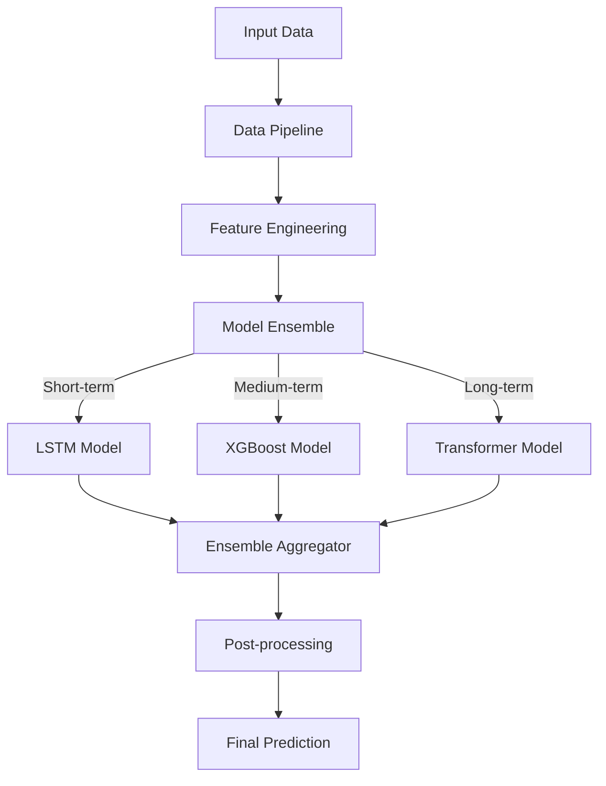

# Model Architecture Guide

## Overview

The Energy Forecast Platform uses a sophisticated ensemble of machine learning models to predict energy consumption across Indian cities.

## Model Architecture



## Data Pipeline

### 1. Data Sources

```python
# core/data/sources.py
class DataSource:
    """Base class for data sources."""
    
    def __init__(self, config: Dict[str, Any]):
        self.config = config
        self.validators = self._init_validators()
    
    @abstractmethod
    def fetch_data(self) -> pd.DataFrame:
        """Fetch data from source."""
        pass

class WeatherData(DataSource):
    """Weather data source."""
    
    def fetch_data(self) -> pd.DataFrame:
        """Fetch weather data."""
        return pd.DataFrame({
            'temperature': self._get_temperature(),
            'humidity': self._get_humidity(),
            'wind_speed': self._get_wind_speed(),
            'precipitation': self._get_precipitation()
        })

class ConsumptionData(DataSource):
    """Energy consumption data source."""
    
    def fetch_data(self) -> pd.DataFrame:
        """Fetch consumption data."""
        return pd.DataFrame({
            'timestamp': self._get_timestamps(),
            'consumption': self._get_consumption(),
            'location': self._get_locations()
        })
```

### 2. Data Preprocessing

```python
# core/data/preprocessor.py
class DataPreprocessor:
    """Preprocess raw data for model input."""
    
    def __init__(self):
        self.scalers = {
            'standard': StandardScaler(),
            'robust': RobustScaler(),
            'minmax': MinMaxScaler()
        }
    
    def process(self, data: pd.DataFrame) -> pd.DataFrame:
        """Process raw data."""
        return self.pipeline([
            self._clean_data,
            self._handle_missing_values,
            self._scale_features,
            self._encode_categorical
        ], data)
    
    def _clean_data(self, data: pd.DataFrame) -> pd.DataFrame:
        """Remove outliers and invalid data."""
        return data[
            (np.abs(stats.zscore(data)) < 3).all(axis=1)
        ]
    
    def _handle_missing_values(self, data: pd.DataFrame) -> pd.DataFrame:
        """Handle missing values using advanced imputation."""
        imputer = IterativeImputer(
            estimator=RandomForestRegressor(),
            random_state=42
        )
        return pd.DataFrame(
            imputer.fit_transform(data),
            columns=data.columns
        )
```

## Feature Engineering

### 1. Feature Extractors

```python
# core/features/extractors.py
class FeatureExtractor:
    """Extract features from preprocessed data."""
    
    def __init__(self, config: Dict[str, Any]):
        self.config = config
        self.feature_sets = self._init_feature_sets()
    
    def extract_features(self, data: pd.DataFrame) -> pd.DataFrame:
        """Extract all features."""
        features = pd.DataFrame()
        
        # Time-based features
        features = features.join(self._extract_time_features(data))
        
        # Weather features
        features = features.join(self._extract_weather_features(data))
        
        # Statistical features
        features = features.join(self._extract_statistical_features(data))
        
        return features
    
    def _extract_time_features(self, data: pd.DataFrame) -> pd.DataFrame:
        """Extract time-based features."""
        return pd.DataFrame({
            'hour': data.index.hour,
            'day_of_week': data.index.dayofweek,
            'month': data.index.month,
            'is_weekend': data.index.dayofweek.isin([5, 6]),
            'is_holiday': self._is_holiday(data.index)
        })
```

### 2. Feature Selection

```python
# core/features/selector.py
class FeatureSelector:
    """Select most important features."""
    
    def __init__(self, method: str = 'recursive'):
        self.method = method
        self.selector = self._init_selector()
    
    def select_features(
        self,
        features: pd.DataFrame,
        target: pd.Series
    ) -> pd.DataFrame:
        """Select features based on importance."""
        if self.method == 'recursive':
            return self._recursive_feature_elimination(features, target)
        elif self.method == 'importance':
            return self._feature_importance(features, target)
        
    def _recursive_feature_elimination(
        self,
        features: pd.DataFrame,
        target: pd.Series
    ) -> pd.DataFrame:
        """Use RFE for feature selection."""
        selector = RFE(
            estimator=RandomForestRegressor(),
            n_features_to_select=self.config['n_features']
        )
        return features[features.columns[selector.fit(features, target).support_]]
```

## Model Components

### 1. LSTM Model (Short-term Predictions)

```python
# core/models/lstm.py
class LSTMModel(BaseModel):
    """LSTM model for short-term predictions."""
    
    def build(self):
        """Build LSTM model architecture."""
        model = Sequential([
            LSTM(
                units=128,
                return_sequences=True,
                input_shape=(self.sequence_length, self.n_features)
            ),
            Dropout(0.2),
            LSTM(units=64, return_sequences=False),
            Dropout(0.2),
            Dense(units=32, activation='relu'),
            Dense(units=self.forecast_horizon)
        ])
        
        model.compile(
            optimizer=Adam(learning_rate=self.config['learning_rate']),
            loss='mse',
            metrics=['mae', 'mape']
        )
        
        return model
```

### 2. XGBoost Model (Medium-term Predictions)

```python
# core/models/xgboost_model.py
class XGBoostModel(BaseModel):
    """XGBoost model for medium-term predictions."""
    
    def build(self):
        """Build XGBoost model."""
        return XGBRegressor(
            n_estimators=1000,
            learning_rate=0.01,
            max_depth=6,
            subsample=0.8,
            colsample_bytree=0.8,
            tree_method='gpu_hist',
            objective='reg:squarederror',
            random_state=42
        )
    
    def train(
        self,
        X_train: np.ndarray,
        y_train: np.ndarray,
        X_val: np.ndarray,
        y_val: np.ndarray
    ):
        """Train XGBoost model."""
        self.model.fit(
            X_train,
            y_train,
            eval_set=[(X_val, y_val)],
            early_stopping_rounds=50,
            verbose=100
        )
```

### 3. Transformer Model (Long-term Predictions)

```python
# core/models/transformer.py
class TransformerModel(BaseModel):
    """Transformer model for long-term predictions."""
    
    def build(self):
        """Build Transformer model architecture."""
        inputs = Input(shape=(self.sequence_length, self.n_features))
        
        # Transformer Encoder
        x = self._build_encoder(inputs)
        
        # Decoder
        x = self._build_decoder(x)
        
        # Output
        outputs = Dense(self.forecast_horizon)(x)
        
        return Model(inputs=inputs, outputs=outputs)
    
    def _build_encoder(self, inputs):
        """Build Transformer encoder."""
        x = inputs
        
        for _ in range(self.config['n_encoder_layers']):
            x = TransformerBlock(
                head_size=self.config['head_size'],
                num_heads=self.config['num_heads'],
                ff_dim=self.config['ff_dim'],
                dropout=self.config['dropout']
            )(x)
            
        return x
```

### 4. Ensemble Aggregator

```python
# core/models/ensemble.py
class EnsembleAggregator:
    """Aggregate predictions from multiple models."""
    
    def __init__(self, models: List[BaseModel], weights: List[float]):
        self.models = models
        self.weights = weights
        
    def predict(self, features: np.ndarray) -> np.ndarray:
        """Generate ensemble predictions."""
        predictions = []
        
        for model, weight in zip(self.models, self.weights):
            pred = model.predict(features)
            predictions.append(pred * weight)
            
        return np.sum(predictions, axis=0)
    
    def update_weights(
        self,
        features: np.ndarray,
        actual: np.ndarray
    ):
        """Update ensemble weights based on performance."""
        errors = []
        
        for model in self.models:
            pred = model.predict(features)
            error = mean_squared_error(actual, pred)
            errors.append(error)
            
        # Update weights inversely proportional to errors
        total_error = sum(errors)
        self.weights = [
            (total_error - error) / ((len(errors) - 1) * total_error)
            for error in errors
        ]
```

## Model Training

### 1. Training Pipeline

```python
# core/training/pipeline.py
class ModelTrainingPipeline:
    """End-to-end training pipeline."""
    
    def __init__(self, config: Dict[str, Any]):
        self.config = config
        self.data_loader = DataLoader(config['data'])
        self.preprocessor = DataPreprocessor()
        self.feature_extractor = FeatureExtractor(config['features'])
        self.models = self._init_models()
        
    def train(self):
        """Execute training pipeline."""
        # Load and preprocess data
        data = self.data_loader.load_data()
        processed_data = self.preprocessor.process(data)
        
        # Extract features
        features = self.feature_extractor.extract_features(processed_data)
        
        # Split data
        train_data, val_data, test_data = self._split_data(features)
        
        # Train models
        for model in self.models:
            model.train(
                train_data['X'],
                train_data['y'],
                val_data['X'],
                val_data['y']
            )
            
        # Evaluate models
        self._evaluate_models(test_data)
```

### 2. Model Evaluation

```python
# core/evaluation/evaluator.py
class ModelEvaluator:
    """Evaluate model performance."""
    
    def __init__(self):
        self.metrics = {
            'mse': mean_squared_error,
            'mae': mean_absolute_error,
            'mape': mean_absolute_percentage_error,
            'r2': r2_score
        }
    
    def evaluate(
        self,
        model: BaseModel,
        X_test: np.ndarray,
        y_test: np.ndarray
    ) -> Dict[str, float]:
        """Evaluate model performance."""
        predictions = model.predict(X_test)
        
        return {
            name: metric(y_test, predictions)
            for name, metric in self.metrics.items()
        }
    
    def generate_report(
        self,
        model: BaseModel,
        X_test: np.ndarray,
        y_test: np.ndarray
    ) -> Dict[str, Any]:
        """Generate detailed evaluation report."""
        metrics = self.evaluate(model, X_test, y_test)
        
        return {
            'metrics': metrics,
            'feature_importance': self._get_feature_importance(model),
            'residuals': self._analyze_residuals(
                y_test,
                model.predict(X_test)
            ),
            'prediction_intervals': self._calculate_prediction_intervals(
                model,
                X_test
            )
        }
```

## Model Serving

### 1. Model Server

```python
# core/serving/server.py
class ModelServer:
    """Serve model predictions."""
    
    def __init__(self):
        self.ensemble = self._load_ensemble()
        self.preprocessor = DataPreprocessor()
        self.feature_extractor = FeatureExtractor()
        
    async def predict(
        self,
        data: Dict[str, Any]
    ) -> Dict[str, Any]:
        """Generate predictions."""
        # Preprocess input
        processed_data = self.preprocessor.process(data)
        
        # Extract features
        features = self.feature_extractor.extract_features(processed_data)
        
        # Generate predictions
        predictions = self.ensemble.predict(features)
        
        # Post-process predictions
        return self._format_predictions(predictions)
    
    def _format_predictions(
        self,
        predictions: np.ndarray
    ) -> Dict[str, Any]:
        """Format predictions for API response."""
        return {
            'predictions': predictions.tolist(),
            'metadata': {
                'model_version': self.ensemble.version,
                'timestamp': datetime.now().isoformat(),
                'confidence_intervals': self._calculate_confidence_intervals(
                    predictions
                )
            }
        }
```

### 2. Model Monitoring

```python
# core/monitoring/monitor.py
class ModelMonitor:
    """Monitor model performance in production."""
    
    def __init__(self):
        self.metrics_client = PrometheusClient()
        self.logger = logging.getLogger(__name__)
        
    def log_prediction(
        self,
        features: np.ndarray,
        prediction: np.ndarray,
        actual: Optional[np.ndarray] = None
    ):
        """Log prediction metrics."""
        # Log prediction latency
        self.metrics_client.histogram(
            'prediction_latency',
            time.time() - start_time
        )
        
        # Log prediction values
        self.metrics_client.gauge(
            'prediction_value',
            prediction.mean()
        )
        
        # Log accuracy if actual value is available
        if actual is not None:
            error = np.mean(np.abs(prediction - actual))
            self.metrics_client.gauge('prediction_error', error)
            
    def check_drift(
        self,
        features: np.ndarray,
        window_size: int = 1000
    ):
        """Check for feature drift."""
        historical_features = self._get_historical_features(window_size)
        
        for feature_idx in range(features.shape[1]):
            drift_score = wasserstein_distance(
                historical_features[:, feature_idx],
                features[:, feature_idx]
            )
            
            if drift_score > self.config['drift_threshold']:
                self.logger.warning(
                    f"Feature drift detected in feature {feature_idx}"
                )
                self.metrics_client.increment(
                    'feature_drift',
                    labels={'feature': feature_idx}
                )
```

## Model Optimization

### 1. Hyperparameter Optimization

```python
# core/optimization/hyperopt.py
class HyperparameterOptimizer:
    """Optimize model hyperparameters."""
    
    def __init__(self, model_class: Type[BaseModel]):
        self.model_class = model_class
        self.study = optuna.create_study(
            direction='minimize',
            pruner=optuna.pruners.MedianPruner()
        )
    
    def optimize(
        self,
        X_train: np.ndarray,
        y_train: np.ndarray,
        n_trials: int = 100
    ):
        """Run hyperparameter optimization."""
        self.study.optimize(
            lambda trial: self._objective(
                trial,
                X_train,
                y_train
            ),
            n_trials=n_trials
        )
        
        return self.study.best_params
    
    def _objective(
        self,
        trial: optuna.Trial,
        X_train: np.ndarray,
        y_train: np.ndarray
    ) -> float:
        """Objective function for optimization."""
        params = self._get_trial_params(trial)
        model = self.model_class(**params)
        
        scores = cross_val_score(
            model,
            X_train,
            y_train,
            cv=5,
            scoring='neg_mean_squared_error'
        )
        
        return -scores.mean()
```

### 2. Model Compression

```python
# core/optimization/compression.py
class ModelCompressor:
    """Compress models for efficient deployment."""
    
    def __init__(self):
        self.quantizer = tfmot.quantization.keras.quantize_model
        
    def compress_model(
        self,
        model: tf.keras.Model,
        dataset: tf.data.Dataset
    ) -> tf.keras.Model:
        """Compress model using quantization."""
        # Define quantization config
        quantization_config = tfmot.quantization.keras.QuantizeConfig(
            ['dense', 'lstm'],
            8,
            'weights_and_activations'
        )
        
        # Quantize model
        quantized_model = self.quantizer(
            model,
            quantization_config
        )
        
        # Fine-tune quantized model
        quantized_model.compile(
            optimizer=model.optimizer,
            loss=model.loss,
            metrics=model.metrics
        )
        
        quantized_model.fit(
            dataset,
            epochs=5,
            validation_split=0.2
        )
        
        return quantized_model
```

This comprehensive guide details the entire model architecture, from data processing to model serving and optimization. Each component is explained with practical code examples and clear documentation.
