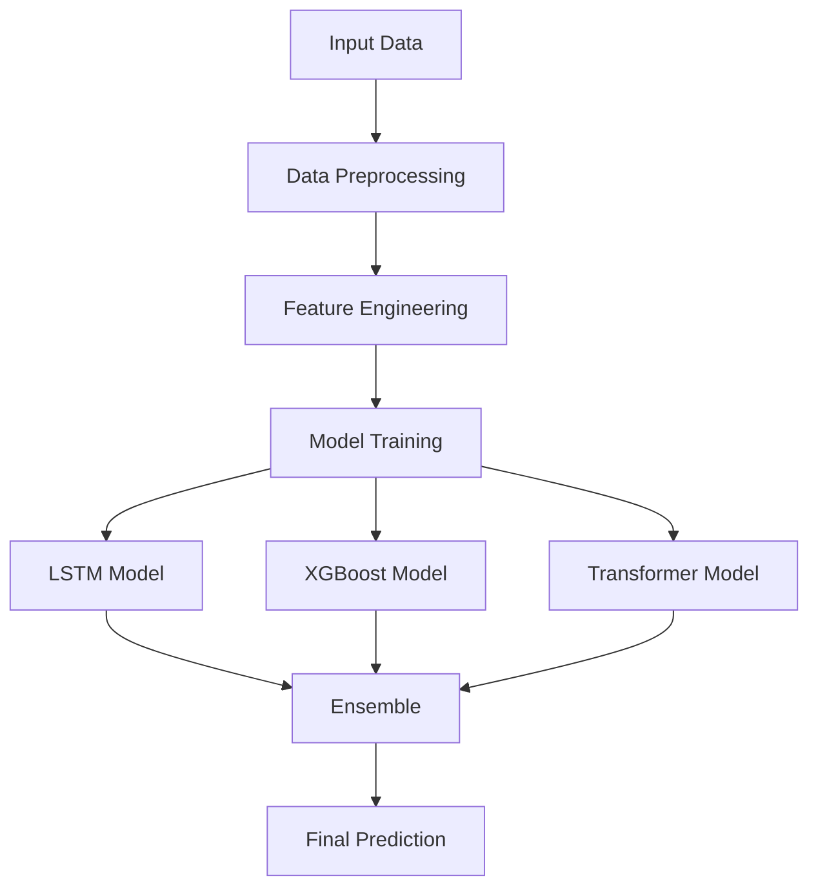

# Model Training Guide

## Overview

This guide details the machine learning pipeline for training and updating energy consumption forecasting models.

## Model Architecture

### 1. Ensemble Model Components

```python
class EnergyForecastEnsemble:
    def __init__(self):
        self.lstm_model = LSTMModel(
            input_dim=12,
            hidden_dim=64,
            num_layers=2,
            dropout=0.2
        )
        self.xgboost_model = XGBRegressor(
            max_depth=6,
            learning_rate=0.1,
            n_estimators=100,
            objective='reg:squarederror'
        )
        self.transformer_model = TransformerModel(
            d_model=256,
            nhead=8,
            num_layers=4,
            dim_feedforward=1024
        )
```

### Ensemble Approach



## Data Pipeline

### Data Sources
- Historical energy consumption
- Weather data
- Holiday calendar
- Special events
- City demographics

### Preprocessing Steps
1. Data cleaning
2. Feature engineering
3. Normalization
4. Time series alignment

## Model Components

### LSTM Model
- Sequence length: 168 hours
- Hidden layers: 3
- Units per layer: [128, 64, 32]
- Dropout: 0.2

### XGBoost Model
- Max depth: 8
- Learning rate: 0.01
- Number of estimators: 1000
- Early stopping rounds: 50

### Transformer Model
- Attention heads: 8
- Encoder layers: 6
- Embedding dimension: 256
- Feedforward dimension: 1024

## Training Process

### Environment Setup
```bash
# Create virtual environment
python -m venv env

# Install dependencies
pip install -r requirements.txt

# Set up environment variables
source setup_env.sh
```

### Training Steps
1. Data preparation
2. Model initialization
3. Training loop
4. Validation
5. Model selection

## Model Evaluation

### Metrics
- MAPE (Mean Absolute Percentage Error)
- MAE (Mean Absolute Error)
- RMSE (Root Mean Square Error)
- R² Score

### Validation Strategy
- K-fold cross-validation
- Out-of-time validation
- City-wise validation

## Model Deployment

### Production Pipeline
1. Model versioning
2. A/B testing
3. Gradual rollout
4. Performance monitoring

### Monitoring
- Prediction accuracy
- Inference latency
- Resource usage
- Drift detection

## Optimization

### Hyperparameter Tuning
- Bayesian optimization
- Grid search
- Random search

### Performance Optimization
- Model quantization
- Pruning
- Batch inference
- GPU acceleration

## Best Practices

### Code Quality
- Type hints
- Docstrings
- Unit tests
- Integration tests

### Version Control
- Model versioning
- Data versioning
- Experiment tracking
- Code versioning

## Related Documentation
- [API Reference](./api_reference.md)
- [Deployment Guide](./deployment_guide.md)
- [Performance Optimization](./performance_optimization.md)
- [Testing Guide](./testing_guide.md)
- [FAQ](./faq.md)

## Model Training

### 1. Data Preprocessing

```python
def preprocess_data(
    start_date: datetime,
    end_date: datetime,
    city_id: int
) -> Tuple[np.ndarray, np.ndarray]:
    """
    Preprocess data for model training.
    """
    # Load raw data
    raw_data = load_data(start_date, end_date, city_id)
    
    # Clean data
    cleaned_data = clean_data(raw_data)
    
    # Feature engineering
    features = prepare_features(cleaned_data)
    
    # Split features and target
    X = features.drop('consumption', axis=1)
    y = features['consumption']
    
    # Scale features
    scaler = StandardScaler()
    X_scaled = scaler.fit_transform(X)
    
    return X_scaled, y
```

### 2. Model Training

```python
def train_model(
    X_train: np.ndarray,
    y_train: np.ndarray,
    config: Dict[str, Any]
) -> EnergyForecastEnsemble:
    """
    Train the ensemble model.
    """
    ensemble = EnergyForecastEnsemble()
    
    # Train LSTM
    ensemble.lstm_model.fit(
        X_train,
        y_train,
        batch_size=config['batch_size'],
        epochs=config['epochs'],
        validation_split=0.2
    )
    
    # Train XGBoost
    ensemble.xgboost_model.fit(
        X_train,
        y_train,
        eval_set=[(X_val, y_val)],
        early_stopping_rounds=10
    )
    
    # Train Transformer
    ensemble.transformer_model.fit(
        X_train,
        y_train,
        batch_size=config['batch_size'],
        epochs=config['epochs']
    )
    
    return ensemble
```

### 3. Model Evaluation

```python
def evaluate_model(
    model: EnergyForecastEnsemble,
    X_test: np.ndarray,
    y_test: np.ndarray
) -> Dict[str, float]:
    """
    Evaluate model performance.
    """
    metrics = {}
    
    # LSTM predictions
    lstm_pred = model.lstm_model.predict(X_test)
    metrics['lstm_mae'] = mean_absolute_error(y_test, lstm_pred)
    metrics['lstm_mape'] = mean_absolute_percentage_error(y_test, lstm_pred)
    
    # XGBoost predictions
    xgb_pred = model.xgboost_model.predict(X_test)
    metrics['xgb_mae'] = mean_absolute_error(y_test, xgb_pred)
    metrics['xgb_mape'] = mean_absolute_percentage_error(y_test, xgb_pred)
    
    # Transformer predictions
    transformer_pred = model.transformer_model.predict(X_test)
    metrics['transformer_mae'] = mean_absolute_error(y_test, transformer_pred)
    metrics['transformer_mape'] = mean_absolute_percentage_error(y_test, transformer_pred)
    
    # Ensemble predictions
    ensemble_pred = (lstm_pred + xgb_pred + transformer_pred) / 3
    metrics['ensemble_mae'] = mean_absolute_error(y_test, ensemble_pred)
    metrics['ensemble_mape'] = mean_absolute_percentage_error(y_test, ensemble_pred)
    
    return metrics
```

## Model Versioning

### 1. Model Registry

```python
def register_model(
    model: EnergyForecastEnsemble,
    metrics: Dict[str, float],
    config: Dict[str, Any]
) -> str:
    """
    Register trained model in the model registry.
    """
    # Generate model version
    version = datetime.now().strftime("%Y%m%d_%H%M%S")
    
    # Save model artifacts
    model_path = f"models/energy_forecast_v{version}"
    save_model(model, model_path)
    
    # Log metrics and config
    mlflow.log_metrics(metrics)
    mlflow.log_params(config)
    
    # Register model
    mlflow.register_model(
        model_path,
        "energy_forecast",
        version=version
    )
    
    return version
```

### 2. Model Deployment

```python
def deploy_model(version: str) -> None:
    """
    Deploy model to production.
    """
    # Load model from registry
    model = load_model(f"models/energy_forecast_v{version}")
    
    # Update model endpoints
    update_prediction_service(model)
    
    # Update model metadata
    update_model_metadata(version)
```

## Automated Training Pipeline

### 1. Training Schedule

```yaml
# training_schedule.yaml
schedule:
  daily_retraining:
    cron: "0 2 * * *"  # Run at 2 AM daily
    config:
      training_window: "7d"
      validation_window: "1d"
      
  weekly_full_training:
    cron: "0 1 * * 0"  # Run at 1 AM on Sundays
    config:
      training_window: "90d"
      validation_window: "7d"
```

### 2. Training Job

```python
def run_training_job(config: Dict[str, Any]) -> None:
    """
    Run automated training job.
    """
    try:
        # Prepare data
        X_train, y_train = preprocess_data(
            start_date=config['start_date'],
            end_date=config['end_date'],
            city_id=config['city_id']
        )
        
        # Train model
        model = train_model(X_train, y_train, config)
        
        # Evaluate model
        metrics = evaluate_model(model, X_test, y_test)
        
        # Register if performance improved
        if is_performance_improved(metrics):
            version = register_model(model, metrics, config)
            deploy_model(version)
            
    except Exception as e:
        logger.error(f"Training failed: {str(e)}")
        notify_team(f"Training failed: {str(e)}")
```

## Performance Monitoring

### 1. Metrics Collection

```python
def collect_model_metrics(
    predictions: np.ndarray,
    actuals: np.ndarray,
    metadata: Dict[str, Any]
) -> None:
    """
    Collect and store model performance metrics.
    """
    metrics = {
        'timestamp': datetime.now(),
        'model_version': metadata['version'],
        'mae': mean_absolute_error(actuals, predictions),
        'mape': mean_absolute_percentage_error(actuals, predictions),
        'rmse': root_mean_squared_error(actuals, predictions)
    }
    
    # Store metrics
    store_metrics(metrics)
    
    # Check for performance degradation
    if is_performance_degraded(metrics):
        trigger_retraining()
```

### 2. Performance Monitoring

```python
def monitor_model_performance() -> None:
    """
    Monitor model performance and trigger retraining if needed.
    """
    # Get recent metrics
    recent_metrics = get_recent_metrics(hours=24)
    
    # Calculate performance trends
    trends = calculate_performance_trends(recent_metrics)
    
    # Check for degradation
    if is_performance_degraded(trends):
        logger.warning("Model performance degradation detected")
        notify_team("Performance degradation detected")
        trigger_retraining()
```

## Best Practices

1. **Data Quality**
   - Validate input data quality
   - Handle missing values appropriately
   - Remove outliers carefully
   - Ensure consistent data formats

2. **Model Training**
   - Use cross-validation
   - Implement early stopping
   - Monitor for overfitting
   - Save checkpoints regularly

3. **Deployment**
   - Version all model artifacts
   - Maintain reproducible environments
   - Implement gradual rollout
   - Monitor deployment health

4. **Monitoring**
   - Track prediction accuracy
   - Monitor resource usage
   - Set up alerting
   - Regular performance reviews

## Additional Resources

- [Configuration Guide](./configuration_guide.md)
- [API Reference](./api_reference.md)
- [Infrastructure Guide](./infrastructure_guide.md)
- [Monitoring Guide](./monitoring_guide.md)
