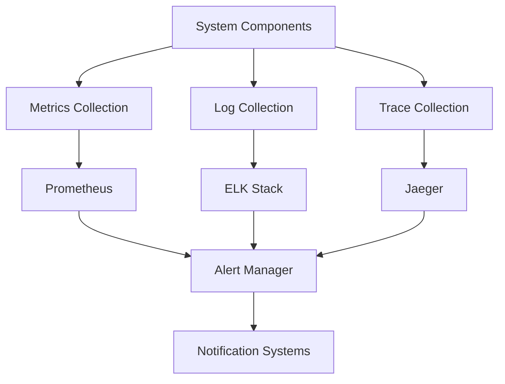

# Monitoring and Alerting Guide

## Overview

This guide outlines the comprehensive monitoring and alerting strategy for the Energy Forecast Platform.

## Monitoring Architecture



## Metrics Collection

### Core Metrics
```python
from prometheus_client import Counter, Gauge, Histogram, Summary

# API Metrics
api_requests = Counter(
    'api_requests_total',
    'Total API requests',
    ['endpoint', 'method', 'status']
)

api_latency = Histogram(
    'api_latency_seconds',
    'API request latency',
    ['endpoint'],
    buckets=[0.1, 0.5, 1.0, 2.0, 5.0]
)

# ML Model Metrics
model_predictions = Counter(
    'model_predictions_total',
    'Total model predictions',
    ['model_version', 'city']
)

prediction_latency = Histogram(
    'prediction_latency_seconds',
    'Model prediction latency',
    ['model_version']
)

model_accuracy = Gauge(
    'model_accuracy',
    'Model accuracy score',
    ['model_version', 'metric']
)

# System Metrics
resource_usage = Gauge(
    'resource_usage',
    'Resource utilization',
    ['resource_type', 'instance']
)
```

### Custom Metrics Implementation
```python
class MetricsCollector:
    def __init__(self):
        self.timestamp = "2024-12-08T23:46:32+05:30"
        self.collectors = {
            "api": self.collect_api_metrics,
            "model": self.collect_model_metrics,
            "system": self.collect_system_metrics
        }
    
    async def collect_metrics(self, collector_type: str):
        """Collect specified metrics."""
        if collector_type not in self.collectors:
            raise ValueError(f"Invalid collector type: {collector_type}")
        
        try:
            metrics = await self.collectors[collector_type]()
            await self.store_metrics(metrics)
            await self.check_thresholds(metrics)
        except Exception as e:
            await self.handle_collection_error(collector_type, str(e))
            raise
```

## Log Management

### Structured Logging
```python
import structlog

logger = structlog.get_logger()

class LogManager:
    def __init__(self):
        self.log_levels = {
            "debug": logger.debug,
            "info": logger.info,
            "warning": logger.warning,
            "error": logger.error,
            "critical": logger.critical
        }
    
    def log_event(self, level: str, event: str, **kwargs):
        """Log event with structured data."""
        if level not in self.log_levels:
            raise ValueError(f"Invalid log level: {level}")
        
        context = {
            "timestamp": "2024-12-08T23:46:32+05:30",
            "service": kwargs.get("service", "energy-forecast"),
            "trace_id": kwargs.get("trace_id", generate_trace_id()),
            **kwargs
        }
        
        self.log_levels[level](event, **context)
```

### Log Processing
```python
class LogProcessor:
    async def process_logs(self, log_stream: str):
        """Process incoming log stream."""
        processors = [
            self.parse_log,
            self.enrich_log,
            self.filter_sensitive_data,
            self.add_metadata
        ]
        
        for processor in processors:
            log_stream = await processor(log_stream)
        
        return log_stream
    
    async def parse_log(self, log: str) -> dict:
        """Parse log into structured format."""
        return {
            "timestamp": extract_timestamp(log),
            "level": extract_level(log),
            "message": extract_message(log),
            "context": extract_context(log)
        }
```

## Alerting System

### Alert Configuration
```python
class AlertConfig:
    def define_alerts(self) -> dict:
        """Define alert configurations."""
        return {
            "high_latency": {
                "metric": "api_latency_seconds",
                "threshold": 2.0,
                "duration": "5m",
                "severity": "critical",
                "channels": ["slack", "email"]
            },
            "model_accuracy_drop": {
                "metric": "model_accuracy",
                "threshold": 0.85,
                "duration": "1h",
                "severity": "high",
                "channels": ["slack", "email"]
            },
            "resource_usage": {
                "metric": "resource_usage",
                "threshold": 80.0,
                "duration": "10m",
                "severity": "warning",
                "channels": ["slack"]
            }
        }
```

### Alert Manager
```python
class AlertManager:
    def __init__(self):
        self.notification_channels = {
            "slack": self.send_slack_alert,
            "email": self.send_email_alert,
            "sms": self.send_sms_alert
        }
    
    async def handle_alert(self, alert: dict):
        """Handle incoming alert."""
        try:
            # Deduplicate alert
            if self.is_duplicate_alert(alert):
                return
            
            # Enrich alert
            enriched_alert = await self.enrich_alert(alert)
            
            # Route alert
            await self.route_alert(enriched_alert)
            
            # Track alert
            await self.track_alert(enriched_alert)
        except Exception as e:
            await self.handle_alert_error(alert, str(e))
            raise
    
    async def route_alert(self, alert: dict):
        """Route alert to appropriate channels."""
        channels = alert.get("channels", [])
        for channel in channels:
            if channel in self.notification_channels:
                await self.notification_channels[channel](alert)
```

## Implementation Scenarios

### Scenario 1: High API Latency Detection
```python
class LatencyMonitor:
    async def monitor_latency(self):
        """Monitor API latency and trigger alerts."""
        while True:
            try:
                # Collect latency metrics
                latency_data = await self.collect_latency_metrics()
                
                # Check thresholds
                for endpoint, latency in latency_data.items():
                    if latency > 2.0:  # 2 seconds threshold
                        await self.trigger_latency_alert(endpoint, latency)
                
                await asyncio.sleep(60)  # Check every minute
            except Exception as e:
                logger.error(f"Latency monitoring error: {e}")
```

### Scenario 2: Model Performance Degradation
```python
class ModelMonitor:
    async def monitor_model_performance(self):
        """Monitor model performance metrics."""
        metrics = {
            "accuracy": self.check_accuracy,
            "latency": self.check_latency,
            "error_rate": self.check_error_rate
        }
        
        try:
            for metric_name, check_func in metrics.items():
                result = await check_func()
                if not result["status"]:
                    await self.handle_performance_degradation(
                        metric_name,
                        result["value"],
                        result["threshold"]
                    )
        except Exception as e:
            logger.error(f"Model monitoring error: {e}")
```

### Scenario 3: Resource Utilization
```python
class ResourceMonitor:
    async def monitor_resources(self):
        """Monitor system resource utilization."""
        resources = {
            "cpu": self.monitor_cpu,
            "memory": self.monitor_memory,
            "disk": self.monitor_disk,
            "network": self.monitor_network
        }
        
        while True:
            try:
                for resource, monitor_func in resources.items():
                    usage = await monitor_func()
                    if usage > 80:  # 80% threshold
                        await self.trigger_resource_alert(resource, usage)
                
                await asyncio.sleep(300)  # Check every 5 minutes
            except Exception as e:
                logger.error(f"Resource monitoring error: {e}")
```

### Scenario 4: Security Monitoring
```python
class SecurityMonitor:
    async def monitor_security_events(self):
        """Monitor security-related events."""
        events = {
            "failed_auth": self.monitor_auth_failures,
            "api_abuse": self.monitor_api_abuse,
            "data_access": self.monitor_data_access,
            "system_changes": self.monitor_system_changes
        }
        
        try:
            for event_type, monitor_func in events.items():
                violations = await monitor_func()
                if violations:
                    await self.handle_security_violation(
                        event_type,
                        violations
                    )
        except Exception as e:
            logger.error(f"Security monitoring error: {e}")
```

## Dashboard Configuration

### Grafana Dashboard
```python
class DashboardConfig:
    def configure_dashboards(self) -> dict:
        """Configure monitoring dashboards."""
        return {
            "api_performance": {
                "metrics": [
                    "api_requests_total",
                    "api_latency_seconds"
                ],
                "refresh_rate": "1m",
                "time_range": "6h"
            },
            "model_performance": {
                "metrics": [
                    "model_predictions_total",
                    "prediction_latency_seconds",
                    "model_accuracy"
                ],
                "refresh_rate": "5m",
                "time_range": "24h"
            },
            "system_health": {
                "metrics": [
                    "resource_usage",
                    "error_rate",
                    "availability"
                ],
                "refresh_rate": "1m",
                "time_range": "12h"
            }
        }
```

## Related Documentation
- [Infrastructure Guide](./infrastructure_guide.md)
- [Security Guide](./security_guide.md)
- [API Reference](./api_reference.md)
- [Deployment Guide](./deployment_guide.md)
