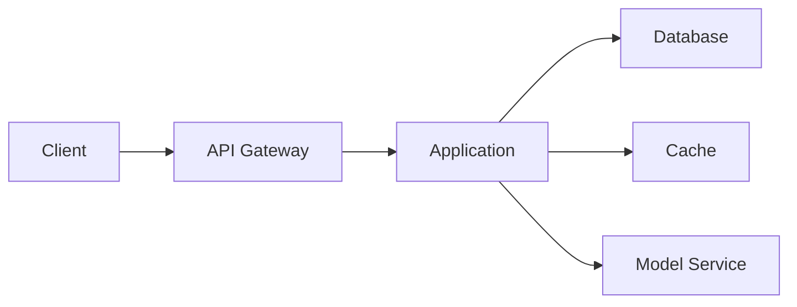
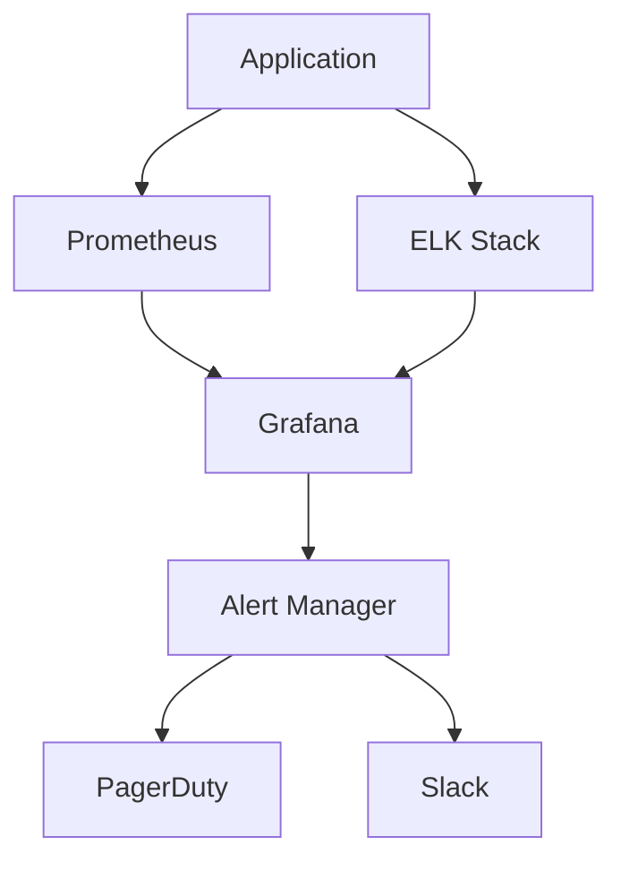

# Monitoring and Observability Guide

## Overview

This guide covers the comprehensive monitoring and observability setup for the Energy Forecast Platform.

## Monitoring Stack

### Core Components

1. **Prometheus**
   - Metrics collection
   - Time-series database
   - Alert manager
   - Service discovery

2. **Grafana**
   - Visualization
   - Dashboards
   - Alerting
   - Reporting

3. **ELK Stack**
   - Log aggregation
   - Log analysis
   - Search capabilities
   - Visualization

4. **APM (Application Performance Monitoring)**
   - Distributed tracing
   - Performance profiling
   - Error tracking
   - User monitoring

## Key Metrics

### System Metrics

1. **Resource Utilization**
```prometheus
# CPU Usage
rate(process_cpu_seconds_total[5m])

# Memory Usage
process_resident_memory_bytes

# Disk Usage
node_filesystem_avail_bytes
```

2. **Network Metrics**
```prometheus
# Network Traffic
rate(node_network_transmit_bytes_total[5m])
rate(node_network_receive_bytes_total[5m])

# Connection Stats
node_netstat_Tcp_CurrEstab
```

### Application Metrics

1. **API Performance**
```prometheus
# Request Latency
histogram_quantile(0.95, sum(rate(http_request_duration_seconds_bucket[5m])) by (le))

# Request Rate
rate(http_requests_total[5m])

# Error Rate
rate(http_requests_total{status=~"5.."}[5m])
```

2. **Model Performance**
```prometheus
# Inference Time
histogram_quantile(0.95, sum(rate(model_inference_duration_seconds_bucket[5m])) by (le))

# Prediction Accuracy
model_prediction_accuracy_percent

# Model Version
model_version_info
```

### Database Metrics

1. **PostgreSQL**
```prometheus
# Connection Pool
pg_stat_activity_count

# Query Performance
rate(pg_stat_statements_total[5m])

# Cache Hit Ratio
pg_stat_database_blks_hit / (pg_stat_database_blks_hit + pg_stat_database_blks_read)
```

2. **Redis**
```prometheus
# Memory Usage
redis_memory_used_bytes

# Hit Rate
redis_keyspace_hits_total / (redis_keyspace_hits_total + redis_keyspace_misses_total)

# Connected Clients
redis_connected_clients
```

## Alert Rules

### Critical Alerts

1. **High Error Rate**
```yaml
alert: HighErrorRate
expr: rate(http_requests_total{status=~"5.."}[5m]) > 0.1
for: 5m
labels:
  severity: critical
annotations:
  summary: High error rate detected
```

2. **Memory Usage**
```yaml
alert: HighMemoryUsage
expr: process_resident_memory_bytes > 1e9
for: 5m
labels:
  severity: warning
annotations:
  summary: High memory usage detected
```

3. **Model Performance**
```yaml
alert: LowModelAccuracy
expr: model_prediction_accuracy_percent < 80
for: 15m
labels:
  severity: critical
annotations:
  summary: Model accuracy below threshold
```

## Dashboards

### System Overview
```grafana
# System Health
CPU Usage: process_cpu_seconds_total
Memory Usage: process_resident_memory_bytes
Disk Usage: node_filesystem_avail_bytes
Network Traffic: node_network_transmit_bytes_total

# Application Health
Request Rate: rate(http_requests_total[5m])
Error Rate: rate(http_requests_total{status=~"5.."}[5m])
Response Time: histogram_quantile(0.95, http_request_duration_seconds_bucket)
```

### Model Performance
```grafana
# Model Metrics
Accuracy: model_prediction_accuracy_percent
Inference Time: model_inference_duration_seconds
Training Status: model_training_status
Feature Importance: model_feature_importance
```

## Log Management

### Log Levels

1. **DEBUG**
   - Detailed debugging information
   - Model training steps
   - Data preprocessing details

2. **INFO**
   - Standard operations
   - API requests
   - Model predictions

3. **WARNING**
   - Performance degradation
   - Resource constraints
   - Data quality issues

4. **ERROR**
   - API failures
   - Model errors
   - Database issues

### Log Format
```json
{
  "timestamp": "ISO8601",
  "level": "INFO|WARNING|ERROR",
  "service": "api|model|database",
  "trace_id": "uuid",
  "message": "string",
  "details": {
    "request_id": "string",
    "user_id": "string",
    "duration_ms": number
  }
}
```

## Tracing

### Distributed Tracing

1. **Request Flow**


2. **Trace Tags**
```yaml
- request_id
- user_id
- model_version
- data_version
- environment
```

## Performance Profiling

### CPU Profiling
```python
@profile_cpu
def model_inference(data):
    # Implementation
    pass
```

### Memory Profiling
```python
@profile_memory
def batch_processing(data):
    # Implementation
    pass
```

## Incident Response

### Severity Levels

1. **SEV1 (Critical)**
   - Service downtime
   - Data loss
   - Security breach

2. **SEV2 (High)**
   - Performance degradation
   - High error rates
   - Model accuracy issues

3. **SEV3 (Medium)**
   - Minor functionality issues
   - Slow response times
   - Warning alerts

### Response Procedures

1. **Incident Detection**
   - Alert triggered
   - Manual report
   - Monitoring alert

2. **Assessment**
   - Impact evaluation
   - Root cause analysis
   - Team notification

3. **Mitigation**
   - Immediate actions
   - Service restoration
   - Data recovery

4. **Resolution**
   - Fix implementation
   - Testing
   - Deployment

5. **Post-mortem**
   - Incident review
   - Documentation
   - Prevention measures

## Maintenance

### Regular Tasks

1. **Daily**
   - Log rotation
   - Metric validation
   - Alert review

2. **Weekly**
   - Performance analysis
   - Capacity planning
   - Backup verification

3. **Monthly**
   - Trend analysis
   - Resource optimization
   - Documentation update

### Backup Procedures

1. **Database Backup**
```bash
# Daily backup
0 0 * * * pg_dump -U user -d database > backup_$(date +%Y%m%d).sql

# Weekly backup
0 0 * * 0 pg_dumpall > full_backup_$(date +%Y%m%d).sql
```

2. **Model Backup**
```bash
# Version backup
aws s3 cp models/ s3://model-backup/ --recursive

# Configuration backup
aws s3 cp config/ s3://config-backup/ --recursive
```

## Security Monitoring

### Access Monitoring
```prometheus
# Failed Login Attempts
rate(auth_login_failed_total[5m])

# API Key Usage
rate(api_key_requests_total[5m])

# Suspicious Activity
rate(security_events_total{type="suspicious"}[5m])
```

### Compliance Monitoring
```prometheus
# Data Access Patterns
rate(data_access_total{type="sensitive"}[5m])

# Encryption Status
encryption_enabled{service="all"}

# Audit Events
rate(audit_events_total[5m])
```

## Performance Targets

### API Performance
- Response Time: < 200ms (p95)
- Error Rate: < 0.1%
- Availability: 99.9%

### Model Performance
- Inference Time: < 100ms
- Accuracy: > 85%
- Training Time: < 4 hours

### Database Performance
- Query Time: < 100ms
- Cache Hit Rate: > 90%
- Connection Pool: < 80% utilized

## Monitoring Architecture



## Key Metrics

### System Metrics
- CPU Usage
- Memory Utilization
- Disk I/O
- Network Traffic

### Application Metrics
- Request Latency
- Error Rates
- Active Users
- Cache Hit Ratio

### Model Metrics
- Inference Time
- Prediction Accuracy
- Model Drift
- Resource Usage

### Database Metrics
- Query Performance
- Connection Pool
- Lock Contention
- Index Usage

## Monitoring Tools

### Prometheus Configuration
```yaml
global:
  scrape_interval: 15s
  evaluation_interval: 15s

scrape_configs:
  - job_name: 'api'
    static_configs:
      - targets: ['localhost:8000']
  
  - job_name: 'model-service'
    static_configs:
      - targets: ['localhost:8001']
```

### Grafana Dashboards
- System Overview
- API Performance
- Model Performance
- Database Health

## Alert Rules

### Critical Alerts
```yaml
groups:
- name: critical_alerts
  rules:
  - alert: HighErrorRate
    expr: error_rate > 0.01
    for: 5m
    labels:
      severity: critical
    annotations:
      summary: High error rate detected

  - alert: APILatency
    expr: api_latency_p95 > 0.5
    for: 5m
    labels:
      severity: critical
```

### Warning Alerts
```yaml
groups:
- name: warning_alerts
  rules:
  - alert: HighCPUUsage
    expr: cpu_usage > 80
    for: 10m
    labels:
      severity: warning

  - alert: LowCacheHitRate
    expr: cache_hit_rate < 0.8
    for: 15m
    labels:
      severity: warning
```

## Logging Strategy

### Log Levels
- ERROR: System failures
- WARN: Potential issues
- INFO: Important events
- DEBUG: Detailed info

### Log Format
```json
{
  "timestamp": "2024-12-08T23:27:01+05:30",
  "level": "INFO",
  "service": "api",
  "trace_id": "abc123",
  "message": "Request processed",
  "metadata": {
    "endpoint": "/forecast",
    "duration_ms": 45,
    "status": 200
  }
}
```

## Health Checks

### Endpoint Health
```python
@app.get("/health")
async def health_check():
    return {
        "status": "healthy",
        "components": {
            "database": await check_db(),
            "cache": await check_cache(),
            "model": await check_model()
        }
    }
```

### Component Health
- Database connectivity
- Cache availability
- Model service status
- External API status

## Performance Monitoring

### Metrics Collection
- Request duration
- Database queries
- Cache operations
- Model inference

### Resource Monitoring
- Container metrics
- Node metrics
- Network metrics
- Storage metrics

## Incident Response

### Severity Levels
1. Critical: Service down
2. High: Major degradation
3. Medium: Minor issues
4. Low: Non-urgent issues

### Response Process
1. Detection
2. Assessment
3. Mitigation
4. Resolution
5. Post-mortem

## Dashboard Templates

### System Dashboard
```yaml
rows:
  - title: System Health
    panels:
      - CPU Usage
      - Memory Usage
      - Disk I/O
      - Network Traffic

  - title: Application Health
    panels:
      - Request Rate
      - Error Rate
      - Response Time
      - Active Users
```

### Model Dashboard
```yaml
rows:
  - title: Model Performance
    panels:
      - Inference Time
      - Prediction Accuracy
      - Model Drift
      - Resource Usage

  - title: Training Metrics
    panels:
      - Training Time
      - Model Size
      - Memory Usage
      - GPU Utilization
```

## Related Documentation
- [Performance Optimization](./performance_optimization.md)
- [Deployment Guide](./deployment_guide.md)
- [API Reference](./api_reference.md)
- [Infrastructure Guide](./infrastructure_guide.md)
- [Disaster Recovery Guide](./disaster_recovery_guide.md)
