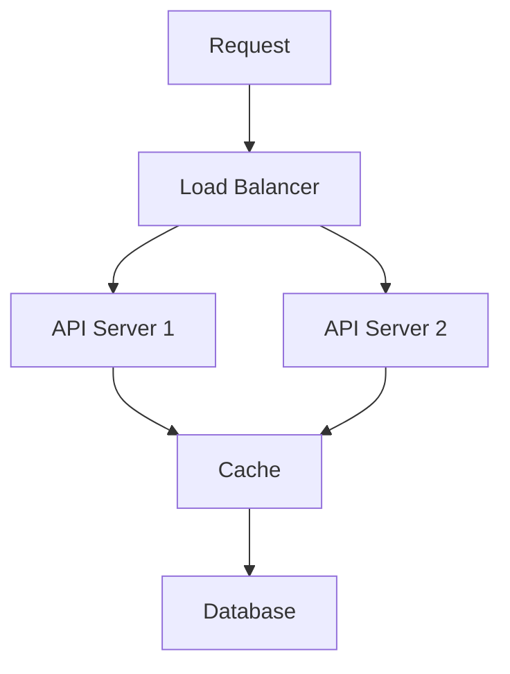

# Performance Optimization Guide

## Overview

This guide outlines strategies and best practices for optimizing the performance of the Energy Forecast Platform across all components.

## Performance Targets

### API Performance
- Response time: < 200ms (p95)
- Throughput: 1000 req/s
- Error rate: < 0.1%

### Model Inference
- Batch prediction: < 100ms
- Single prediction: < 50ms
- Memory usage: < 2GB

### Database
- Query latency: < 100ms
- Connection pool: 20-50
- Cache hit ratio: > 90%

## Optimization Strategies

### 1. API Optimization



#### Caching Strategy
- Redis for hot data
- Local memory cache
- Cache invalidation rules
- Cache warming

#### Connection Pooling
- Database connections
- HTTP client pools
- gRPC connections

### 2. Database Optimization

#### Query Optimization
- Indexing strategy
- Query planning
- Materialized views
- Partitioning

#### Configuration
```ini
max_connections = 200
shared_buffers = 4GB
effective_cache_size = 12GB
maintenance_work_mem = 1GB
```

### 3. Model Optimization

#### Inference
- Model quantization
- Batch processing
- GPU acceleration
- Model pruning

#### Serving
- Model versioning
- A/B testing
- Gradual rollout
- Monitoring

### 4. Infrastructure Optimization

#### Kubernetes
- Resource limits
- HPA configuration
- Node affinity
- Pod disruption budget

#### Networking
- CDN integration
- Service mesh
- Network policies
- Load balancing

## Monitoring and Profiling

### Metrics Collection
- Prometheus metrics
- Custom gauges
- Histograms
- Alert rules

### Dashboards
```yaml
- System metrics
  - CPU usage
  - Memory usage
  - Network I/O
  - Disk I/O

- Application metrics
  - Request latency
  - Error rates
  - Cache hit rates
  - Active connections
```

## Best Practices

### Code Level
- Async operations
- Connection pooling
- Proper indexing
- Query optimization

### Infrastructure Level
- Auto-scaling
- Load balancing
- Caching layers
- CDN usage

### Application Level
- Rate limiting
- Circuit breakers
- Timeout policies
- Retry strategies

## Performance Testing

### Load Testing
- Continuous load
- Spike testing
- Stress testing
- Endurance testing

### Tools
- Apache JMeter
- K6
- Locust
- Artillery

## Related Documentation
- [API Reference](./api_reference.md)
- [Deployment Guide](./deployment_guide.md)
- [Model Training Guide](./model_training_guide.md)
- [Infrastructure Guide](./infrastructure_guide.md)
- [Monitoring Guide](./monitoring_guide.md)
