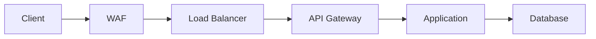

# Security Guide

## Overview

This guide details the security measures implemented in the Energy Forecast Platform.

## Security Architecture

### 1. Authentication & Authorization

#### JWT Authentication
```python
# Generate token
token = security_manager.generate_jwt_token(user_id)

# Validate token
is_valid, payload = security_manager.validate_jwt_token(token)
```

#### API Key Authentication
- Secure key generation
- Key rotation policy
- Access control levels

### 2. Threat Detection

#### Brute Force Protection
```yaml
max_attempts: 5
window_seconds: 3600
lockout_duration: 1800
```

#### DDoS Protection
```yaml
rate_limits:
  1m: 100
  5m: 300
  1h: 1000
```

#### Injection Protection
- SQL injection
- Command injection
- XSS protection
- Path traversal

### 3. Data Protection

#### Encryption
- TLS 1.3
- Data at rest
- Data in transit
- Key management

#### Sensitive Data
```python
patterns = {
    "credit_card": r"\d{4}[- ]?\d{4}[- ]?\d{4}[- ]?\d{4}",
    "ssn": r"\d{3}-\d{2}-\d{4}",
    "email": r"[a-zA-Z0-9._%+-]+@[a-zA-Z0-9.-]+\.[a-zA-Z]{2,}"
}
```

### 4. Network Security

#### Firewall Rules
```yaml
ingress:
  - port: 443
    source: public
  - port: 8000
    source: internal
egress:
  - port: 5432
    destination: database
  - port: 6379
    destination: redis
```

#### TLS Configuration
```nginx
ssl_protocols TLSv1.3;
ssl_ciphers ECDHE-ECDSA-AES256-GCM-SHA384;
ssl_prefer_server_ciphers on;
ssl_session_tickets off;
```

## Security Implementation

### 1. Request Flow



### 2. Security Headers

```python
headers = {
    "X-Content-Type-Options": "nosniff",
    "X-Frame-Options": "DENY",
    "X-XSS-Protection": "1; mode=block",
    "Strict-Transport-Security": "max-age=31536000",
    "Content-Security-Policy": "default-src 'self'",
    "Referrer-Policy": "strict-origin-when-cross-origin"
}
```

### 3. Rate Limiting

```python
class RateLimiter:
    def __init__(self):
        self.windows = {
            "1m": 60,
            "5m": 300,
            "1h": 3600
        }
        self.limits = {
            "1m": 100,
            "5m": 300,
            "1h": 1000
        }
```

### 4. Input Validation

```python
class InputValidator:
    def __init__(self):
        self.patterns = {
            "sql_injection": r"(\b(union|select|insert|delete|drop|exec)\b)",
            "xss": r"(<script|javascript:|data:text/html|<img|onerror=)",
            "path_traversal": r"\.\.\/|\.\.\\",
            "command_injection": r"[;&|`]"
        }
```

## Security Monitoring

### 1. Metrics

```prometheus
# Authentication
rate(auth_failures_total[5m])
rate(token_validation_failures_total[5m])

# Threats
rate(threat_detection_events_total[5m])
sum(threat_events) by (type)

# Rate Limiting
rate(rate_limit_exceeded_total[5m])
```

### 2. Alerts

```yaml
alerts:
  high_auth_failures:
    threshold: 10
    window: 5m
    severity: critical

  ddos_attack:
    threshold: 1000
    window: 1m
    severity: critical

  data_exfiltration:
    threshold: 1000000
    window: 1h
    severity: high
```

### 3. Logging

```python
log_format = {
    "timestamp": "ISO8601",
    "level": "INFO|WARNING|ERROR",
    "event_type": "security_event",
    "source_ip": "string",
    "threat_type": "string",
    "details": "object"
}
```

## Incident Response

### 1. Detection

- Automated detection
- Manual reporting
- External notifications

### 2. Analysis

- Threat assessment
- Impact evaluation
- Root cause analysis

### 3. Containment

- Account lockout
- IP blocking
- Service isolation

### 4. Recovery

- System restoration
- Data verification
- Service resumption

## Security Checklist

### Daily Tasks

- [ ] Monitor security alerts
- [ ] Review authentication logs
- [ ] Check rate limit violations
- [ ] Verify encryption status

### Weekly Tasks

- [ ] Analyze threat patterns
- [ ] Review access logs
- [ ] Update security rules
- [ ] Test monitoring alerts

### Monthly Tasks

- [ ] Security assessment
- [ ] Penetration testing
- [ ] Policy review
- [ ] Team training

## Best Practices

### 1. Authentication

- Use strong passwords
- Implement MFA
- Regular key rotation
- Session management

### 2. Authorization

- Principle of least privilege
- Role-based access
- Regular access review
- Audit logging

### 3. Data Security

- Data classification
- Encryption standards
- Access controls
- Data retention

### 4. Network Security

- Network segmentation
- Traffic monitoring
- DDoS protection
- Regular scanning

## Security Configurations

### 1. WAF Rules

```yaml
rules:
  - id: 1001
    type: sql_injection
    action: block
  - id: 1002
    type: xss
    action: block
  - id: 1003
    type: path_traversal
    action: block
```

### 2. Rate Limiting

```yaml
rate_limits:
  global:
    rate: 1000
    burst: 100
  per_ip:
    rate: 100
    burst: 10
  per_token:
    rate: 500
    burst: 50
```

### 3. Security Groups

```yaml
security_groups:
  api:
    ingress:
      - protocol: tcp
        port: 443
        source: public
    egress:
      - protocol: tcp
        port: 5432
        destination: database
```

## Compliance

### 1. Standards

- ISO 27001
- SOC 2
- GDPR
- PCI DSS

### 2. Requirements

- Data protection
- Access control
- Encryption
- Monitoring

### 3. Auditing

- Regular audits
- Compliance checks
- Documentation
- Reporting
