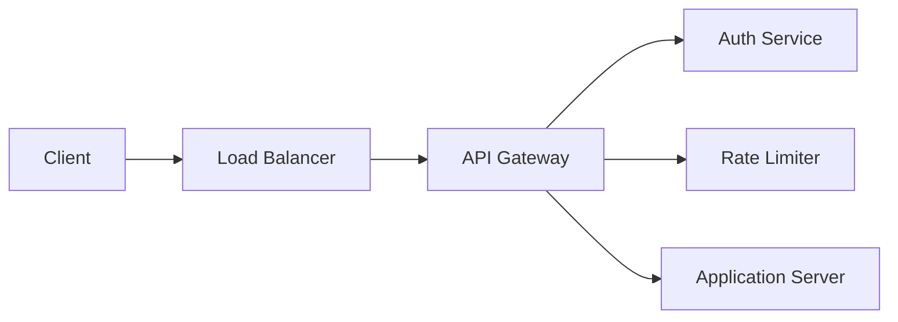
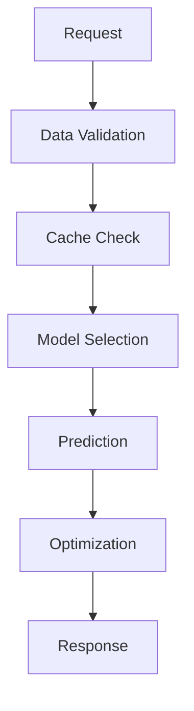
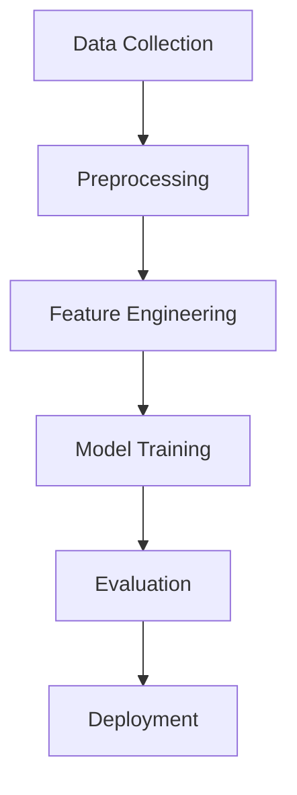

# System Architecture

## Overview

### High-Level Architecture
```
[Client] → [Load Balancer] → [API Gateway]
    ↓
[Application Servers] ↔ [Cache]
    ↓
[Database] ↔ [Model Server] ↔ [Training Pipeline]
```

## Components

### 1. API Layer
- FastAPI framework
- JWT authentication
- Rate limiting
- Request validation

```python
# API Structure
api/
├── main.py          # Application entry
├── routes/          # API endpoints
├── middleware/      # Request processing
└── schemas/         # Data validation
```

### 2. Core Services

#### Model Service
```python
core/
├── models/
│   ├── baseline.py     # Base models
│   ├── advanced.py     # Complex models
│   └── ensemble.py     # Model combination
├── optimization/
│   └── renewable.py    # Energy optimization
└── validation/
    └── data_quality.py # Data validation
```

#### Data Pipeline
```python
pipeline/
├── collectors/     # Data gathering
├── processors/     # Data processing
├── trainers/       # Model training
└── evaluators/     # Performance evaluation
```

### 3. Infrastructure

#### Database Layer
- PostgreSQL (primary data)
- Redis (caching)
- Time-series optimization

```sql
-- Key Tables
CREATE TABLE forecasts (
    id SERIAL PRIMARY KEY,
    city_id INTEGER,
    timestamp TIMESTAMP,
    demand FLOAT,
    confidence_lower FLOAT,
    confidence_upper FLOAT
);

CREATE TABLE energy_mix (
    forecast_id INTEGER,
    source VARCHAR(50),
    allocation FLOAT
);
```

#### Cache Layer
```python
# Cache Configuration
CACHES = {
    'default': {
        'BACKEND': 'django_redis.cache.RedisCache',
        'LOCATION': 'redis://localhost:6379/1',
        'OPTIONS': {
            'CLIENT_CLASS': 'django_redis.client.DefaultClient',
            'COMPRESSOR': 'django_redis.compressors.zlib.ZlibCompressor',
        }
    }
}
```

## Data Flow

### 1. Request Processing


### 2. Forecast Generation


### 3. Model Training


## Scalability

### Horizontal Scaling
```yaml
# Kubernetes Configuration
apiVersion: apps/v1
kind: Deployment
metadata:
  name: energy-forecast
spec:
  replicas: 3
  template:
    spec:
      containers:
      - name: api
        image: energy-forecast:latest
        resources:
          requests:
            cpu: "500m"
            memory: "512Mi"
          limits:
            cpu: "1000m"
            memory: "1Gi"
```

### Load Balancing
```nginx
# Nginx Configuration
upstream api_servers {
    least_conn;
    server api1:8000;
    server api2:8000;
    server api3:8000;
}

server {
    listen 80;
    location / {
        proxy_pass http://api_servers;
    }
}
```

## Security

### Network Security
```yaml
# Network Policy
apiVersion: networking.k8s.io/v1
kind: NetworkPolicy
metadata:
  name: api-network-policy
spec:
  podSelector:
    matchLabels:
      app: energy-forecast
  ingress:
  - from:
    - podSelector:
        matchLabels:
          app: frontend
    ports:
    - protocol: TCP
      port: 8000
```

### Data Security
```python
# Data Encryption
from cryptography.fernet import Fernet

class DataEncryption:
    def __init__(self):
        self.key = Fernet.generate_key()
        self.cipher_suite = Fernet(self.key)
    
    def encrypt(self, data):
        return self.cipher_suite.encrypt(data.encode())
    
    def decrypt(self, encrypted_data):
        return self.cipher_suite.decrypt(encrypted_data).decode()
```

## Monitoring

### Metrics Collection
```python
# Prometheus Metrics
from prometheus_client import Counter, Histogram

REQUEST_COUNT = Counter(
    'request_count',
    'App Request Count',
    ['method', 'endpoint', 'http_status']
)

REQUEST_LATENCY = Histogram(
    'request_latency_seconds',
    'Request latency',
    ['endpoint']
)
```

### Logging
```python
# Structured Logging
import structlog

logger = structlog.get_logger()

logger.info(
    "forecast_generated",
    city="Mumbai",
    accuracy=0.95,
    processing_time=1.2
)
```

## Disaster Recovery

### Backup Strategy
```bash
# Database Backup
pg_dump -Fc energy_forecast > backup.dump

# Model Artifacts
aws s3 sync models/ s3://backup/models/
```

### Recovery Plan
1. Database restoration
2. Model redeployment
3. Cache warming
4. Service verification

## Performance Optimization

### Caching Strategy
```python
from functools import lru_cache

@lru_cache(maxsize=1000)
def get_forecast(city: str, date: str):
    return generate_forecast(city, date)
```

### Database Optimization
```sql
-- Indexes
CREATE INDEX idx_forecasts_city_timestamp 
ON forecasts(city_id, timestamp);

-- Partitioning
CREATE TABLE forecasts (
    id SERIAL,
    city_id INTEGER,
    timestamp TIMESTAMP
) PARTITION BY RANGE (timestamp);
```

## Development Workflow

### CI/CD Pipeline
```yaml
# GitHub Actions
name: CI/CD
on: [push]
jobs:
  test:
    runs-on: ubuntu-latest
    steps:
    - uses: actions/checkout@v2
    - name: Run tests
      run: pytest
  deploy:
    needs: test
    runs-on: ubuntu-latest
    steps:
    - name: Deploy
      run: kubectl apply -f k8s/
```

### Code Quality
```yaml
# Pre-commit Configuration
repos:
-   repo: https://github.com/psf/black
    rev: 21.5b2
    hooks:
    -   id: black
-   repo: https://github.com/pycqa/flake8
    rev: 3.9.2
    hooks:
    -   id: flake8
```

## Future Enhancements

### Planned Features
1. Real-time model updates
2. Multi-region support
3. Advanced analytics
4. Automated optimization

### Technical Debt
1. Cache optimization
2. Test coverage
3. Documentation updates
4. Performance tuning

## Technical Architecture

### Components
1. **API Layer**
   - FastAPI application
   - Request handling
   - Response formatting
   - Input validation

2. **Processing Layer**
   - Model inference
   - Batch processing
   - Data transformation
   - Cache management

3. **Storage Layer**
   - Database operations
   - Cache storage
   - Data persistence
   - Query optimization

4. **Monitoring Layer**
   - Performance tracking
   - Metrics collection
   - Alert management
   - Log aggregation

## Detailed Architecture

### 1. API Layer
```plaintext
Client Request
    │
    ▼
Input Validation ──► Error Handling
    │
    ▼
Request Processing
    │
    ▼
Response Formatting
```

### 2. Processing Layer
```plaintext
Request
    │
    ▼
Cache Check ───► Cache Hit ───► Return Result
    │
    ▼
Batch Collection
    │
    ▼
Model Inference
    │
    ▼
Result Processing
```

### 3. Storage Layer
```plaintext
Data Request
    │
    ▼
Connection Pool ───► Connection Acquisition
    │
    ▼
Query Execution
    │
    ▼
Result Processing
```

### 4. Monitoring Layer
```plaintext
System Event
    │
    ▼
Metric Collection
    │
    ▼
Alert Evaluation
    │
    ▼
Dashboard Update
```

## Performance Characteristics

### 1. Latency Targets
- API Response: < 200ms
- Cache Access: < 10ms
- Database Query: < 100ms
- Model Inference: < 500ms

### 2. Throughput
- Requests/Second: 1000
- Batch Size: 32
- Concurrent Users: 100
- Daily Predictions: 1M

### 3. Resource Usage
- CPU: 4 cores
- Memory: 8GB
- Storage: 20GB
- Network: 100Mbps

## Scalability

### 1. Horizontal Scaling
- API servers
- Database replicas
- Cache nodes
- Model servers

### 2. Vertical Scaling
- CPU allocation
- Memory size
- Storage capacity
- Network bandwidth

## Security

### 1. Authentication
- API key validation
- JWT tokens
- Rate limiting
- IP whitelisting

### 2. Data Protection
- Encryption at rest
- Secure transmission
- Access control
- Audit logging

## Reliability

### 1. Fault Tolerance
- Service redundancy
- Data replication
- Error handling
- Circuit breakers

### 2. Monitoring
- Health checks
- Performance metrics
- Error tracking
- Resource monitoring

## Data Flow

### 1. Request Processing
```plaintext
Client Request
    │
    ▼
Load Balancer
    │
    ▼
API Server ───► Cache Check
    │               │
    ▼               ▼
Model Server    Cache Server
    │               │
    ▼               ▼
Database      Result Return
```

### 2. Batch Processing
```plaintext
Requests
    │
    ▼
Batch Collector
    │
    ▼
Size Optimization
    │
    ▼
Parallel Processing
    │
    ▼
Result Aggregation
```

## System Requirements

### 1. Hardware
- CPU: 4+ cores
- RAM: 8GB+
- Storage: 20GB+
- Network: 100Mbps+

### 2. Software
- Python 3.8+
- Redis 6+
- PostgreSQL 13+
- Docker 20+

## Integration Points

### 1. External Services
- Weather API
- Time series database
- Monitoring services
- Alert systems

### 2. Internal Services
- Model serving
- Cache management
- Data storage
- Metric collection

## Configuration Management

### 1. Environment Variables
```plaintext
Application Settings
    │
    ▼
Service Configuration
    │
    ▼
Resource Allocation
    │
    ▼
Security Parameters
```

### 2. Dynamic Configuration
- Feature flags
- Performance tuning
- Resource allocation
- Alert thresholds

## Deployment Architecture

### 1. Container Orchestration
```plaintext
Docker Compose
    │
    ▼
Service Containers
    │
    ▼
Network Configuration
    │
    ▼
Volume Management
```

### 2. Service Discovery
- Container registration
- Health checking
- Load balancing
- Service routing

## Monitoring Architecture

### 1. Metrics Collection
```plaintext
System Metrics
    │
    ▼
Prometheus Scraping
    │
    ▼
Metric Storage
    │
    ▼
Dashboard Display
```

### 2. Alert Management
- Threshold monitoring
- Alert generation
- Notification routing
- Incident tracking
