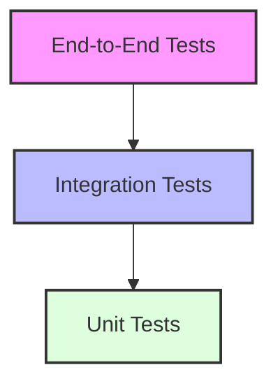

# Testing Strategy and Implementation Guide

## Overview

This guide outlines the comprehensive testing strategy and implementation details for the Energy Forecast Platform, covering all testing levels from unit tests to end-to-end integration tests.

## Testing Pyramid



## Test Structure

```
tests/
├── unit/
│   ├── models/
│   │   ├── test_lstm.py
│   │   ├── test_xgboost.py
│   │   └── test_transformer.py
│   ├── data/
│   │   ├── test_preprocessing.py
│   │   └── test_features.py
│   └── api/
│       ├── test_routes.py
│       └── test_validation.py
├── integration/
│   ├── test_database.py
│   ├── test_cache.py
│   └── test_api.py
└── e2e/
    ├── test_prediction.py
    └── test_training.py
```

## Unit Tests

### 1. Model Tests

```python
# tests/unit/models/test_lstm.py
import pytest
import numpy as np
from models.lstm import LSTMModel

def test_lstm_prediction():
    """Test LSTM model prediction."""
    model = LSTMModel(
        input_dim=12,
        hidden_dim=64,
        num_layers=2
    )
    
    # Test input
    X = np.random.randn(100, 24, 12)
    
    # Get predictions
    predictions = model.predict(X)
    
    assert predictions.shape == (100, 24)
    assert np.all(np.isfinite(predictions))

def test_lstm_training():
    """Test LSTM model training."""
    model = LSTMModel(
        input_dim=12,
        hidden_dim=64,
        num_layers=2
    )
    
    # Training data
    X = np.random.randn(100, 24, 12)
    y = np.random.randn(100, 24)
    
    # Train model
    history = model.fit(
        X, y,
        epochs=2,
        batch_size=32
    )
    
    assert 'loss' in history.history
    assert len(history.history['loss']) == 2
```

### 2. Data Processing Tests

```python
# tests/unit/data/test_preprocessing.py
import pytest
import pandas as pd
from data.preprocessing import clean_data, prepare_features

def test_clean_data():
    """Test data cleaning function."""
    # Test data
    data = pd.DataFrame({
        'timestamp': pd.date_range('2024-01-01', periods=24, freq='H'),
        'consumption': [1.0] * 24,
        'temperature': [20.0] * 24
    })
    
    # Add some missing values
    data.loc[0, 'consumption'] = None
    
    # Clean data
    cleaned = clean_data(data)
    
    assert cleaned.isnull().sum().sum() == 0
    assert len(cleaned) == len(data)

def test_feature_preparation():
    """Test feature preparation."""
    # Test data
    data = pd.DataFrame({
        'timestamp': pd.date_range('2024-01-01', periods=24, freq='H'),
        'consumption': [1.0] * 24,
        'temperature': [20.0] * 24
    })
    
    # Prepare features
    features = prepare_features(data)
    
    expected_columns = [
        'hour', 'day', 'month', 'weekday',
        'temperature', 'consumption_lag_1'
    ]
    
    for col in expected_columns:
        assert col in features.columns
```

## Integration Tests

### 1. Database Integration

```python
# tests/integration/test_database.py
import pytest
from sqlalchemy.orm import Session
from database.models import EnergyConsumption
from database.operations import save_consumption, get_consumption

@pytest.mark.integration
def test_database_operations():
    """Test database operations."""
    # Test data
    consumption_data = {
        'timestamp': '2024-01-01T00:00:00',
        'city_id': 1,
        'consumption': 100.5,
        'temperature': 20.0
    }
    
    # Save data
    saved_id = save_consumption(consumption_data)
    
    # Retrieve data
    retrieved = get_consumption(saved_id)
    
    assert retrieved.consumption == 100.5
    assert retrieved.city_id == 1
```

### 2. Cache Integration

```python
# tests/integration/test_cache.py
import pytest
import redis
from cache.operations import cache_prediction, get_cached_prediction

@pytest.mark.integration
def test_cache_operations():
    """Test cache operations."""
    # Test data
    prediction_key = 'city_1_2024010100'
    prediction_value = 150.75
    
    # Cache prediction
    cache_prediction(prediction_key, prediction_value)
    
    # Get cached prediction
    cached = get_cached_prediction(prediction_key)
    
    assert cached == prediction_value
```

## End-to-End Tests

### 1. Prediction Pipeline

```python
# tests/e2e/test_prediction.py
import pytest
import requests
from datetime import datetime, timedelta

@pytest.mark.e2e
def test_prediction_pipeline():
    """Test complete prediction pipeline."""
    # Test data
    payload = {
        'city_id': 1,
        'timestamp': datetime.now().isoformat(),
        'horizon': '24h'
    }
    
    # Make prediction request
    response = requests.post(
        'http://localhost:8000/api/v1/predict',
        json=payload
    )
    
    assert response.status_code == 200
    
    predictions = response.json()['predictions']
    assert len(predictions) == 24
    
    # Verify prediction format
    for pred in predictions:
        assert 'timestamp' in pred
        assert 'value' in pred
        assert isinstance(pred['value'], float)
```

### 2. Training Pipeline

```python
# tests/e2e/test_training.py
import pytest
import requests
from datetime import datetime, timedelta

@pytest.mark.e2e
def test_training_pipeline():
    """Test complete training pipeline."""
    # Training configuration
    config = {
        'city_id': 1,
        'start_date': (datetime.now() - timedelta(days=30)).isoformat(),
        'end_date': datetime.now().isoformat(),
        'model_type': 'ensemble'
    }
    
    # Trigger training
    response = requests.post(
        'http://localhost:8000/api/v1/train',
        json=config
    )
    
    assert response.status_code == 200
    
    # Get training status
    training_id = response.json()['training_id']
    status_response = requests.get(
        f'http://localhost:8000/api/v1/train/{training_id}/status'
    )
    
    assert status_response.status_code == 200
    assert status_response.json()['status'] in ['running', 'completed']
```

## Performance Tests

### 1. Load Testing

```python
# tests/performance/test_load.py
import pytest
from locust import HttpUser, task, between

class PredictionUser(HttpUser):
    wait_time = between(1, 2)
    
    @task
    def predict(self):
        """Test prediction endpoint under load."""
        payload = {
            'city_id': 1,
            'timestamp': '2024-01-01T00:00:00',
            'horizon': '24h'
        }
        
        with self.client.post(
            '/api/v1/predict',
            json=payload,
            catch_response=True
        ) as response:
            if response.elapsed.total_seconds() > 0.2:
                response.failure('Response too slow')
```

### 2. Stress Testing

```python
# tests/performance/test_stress.py
import pytest
import requests
from concurrent.futures import ThreadPoolExecutor
from datetime import datetime

def make_prediction_request():
    """Make a single prediction request."""
    payload = {
        'city_id': 1,
        'timestamp': datetime.now().isoformat(),
        'horizon': '24h'
    }
    
    return requests.post(
        'http://localhost:8000/api/v1/predict',
        json=payload
    )

@pytest.mark.stress
def test_concurrent_requests():
    """Test system under concurrent requests."""
    n_requests = 100
    
    with ThreadPoolExecutor(max_workers=10) as executor:
        responses = list(executor.map(
            make_prediction_request,
            range(n_requests)
        ))
    
    # Check responses
    success_count = sum(1 for r in responses if r.status_code == 200)
    assert success_count / n_requests >= 0.99  # 99% success rate
```

## Test Configuration

### 1. pytest Configuration

```ini
# pytest.ini
[pytest]
markers =
    unit: Unit tests
    integration: Integration tests
    e2e: End-to-end tests
    performance: Performance tests
    stress: Stress tests

testpaths = tests
python_files = test_*.py
python_classes = Test*
python_functions = test_*

addopts = 
    --verbose
    --durations=10
    --cov=src
    --cov-report=term-missing
```

### 2. Test Environment

```yaml
# test-environment.yaml
name: energy-forecast-test
channels:
  - defaults
  - conda-forge
dependencies:
  - python=3.9
  - pytest
  - pytest-cov
  - pytest-mock
  - pytest-asyncio
  - requests
  - pandas
  - numpy
  - scikit-learn
  - tensorflow
  - xgboost
  - redis-py
  - sqlalchemy
  - locust
```

## CI/CD Integration

### 1. GitHub Actions

```yaml
# .github/workflows/test.yml
name: Tests

on:
  push:
    branches: [ main ]
  pull_request:
    branches: [ main ]

jobs:
  test:
    runs-on: ubuntu-latest
    
    services:
      postgres:
        image: postgres:13
        env:
          POSTGRES_USER: test
          POSTGRES_PASSWORD: test
          POSTGRES_DB: test
        ports:
          - 5432:5432
      
      redis:
        image: redis:6
        ports:
          - 6379:6379
    
    steps:
    - uses: actions/checkout@v2
    
    - name: Set up Python
      uses: actions/setup-python@v2
      with:
        python-version: '3.9'
    
    - name: Install dependencies
      run: |
        python -m pip install --upgrade pip
        pip install -r requirements-test.txt
    
    - name: Run tests
      run: |
        pytest tests/unit/
        pytest tests/integration/
        pytest tests/e2e/
```

## Best Practices

1. **Test Organization**
   - Keep tests organized by type and module
   - Use clear, descriptive test names
   - Follow AAA pattern (Arrange, Act, Assert)
   - Maintain test independence

2. **Test Coverage**
   - Aim for high test coverage (>80%)
   - Focus on critical paths
   - Include edge cases
   - Test error conditions

3. **Test Data**
   - Use fixtures for common test data
   - Avoid hardcoding test values
   - Clean up test data after tests
   - Use realistic test scenarios

4. **Performance Testing**
   - Define clear performance targets
   - Test under various load conditions
   - Monitor resource usage
   - Test failure scenarios

## Additional Resources

- [Development Setup Guide](./development_setup.md)
- [API Reference](./api_reference.md)
- [Model Training Guide](./model_training_guide.md)
- [Configuration Guide](./configuration_guide.md)
